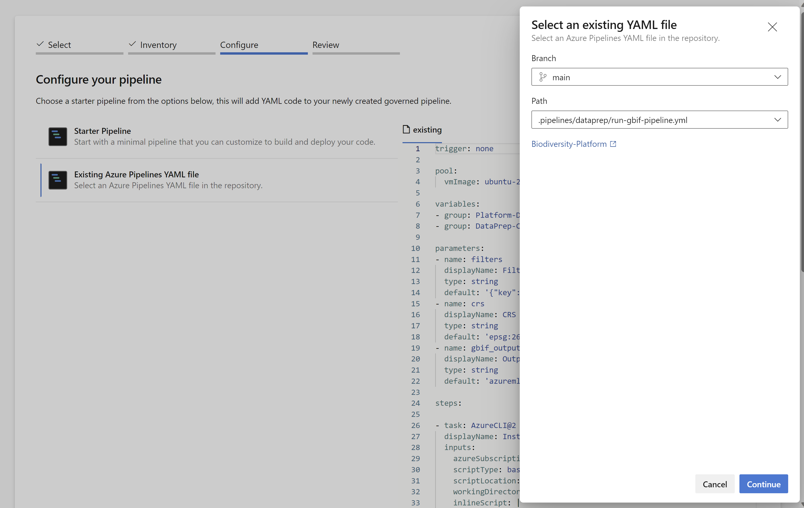
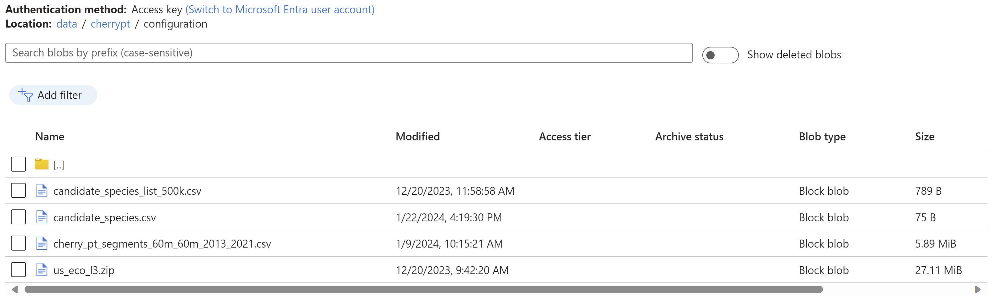

# Data Preparation - Getting Started

## Import Pipelines

Import data preparation pipelines using the `New pipeline` button in Azure Pipelines. To configure the pipeline, select `Existing Azure Pipelines YAML file` and choose the appropriate branch. Then, select the file `.pipelines/dataprep/run-gbif-pipeline.yml` as shown in the provided screenshot.



To continue with the steps, you can use the assistant wizard and consider naming this pipeline as `[Data] 1. Get GBIF`. It is recommended to place this pipeline inside the `Preparation` folder.

For all data preparation pipelines, you can perform the same operations. Remember to save them, but do not run them yet as some configuration files are missing at this stage.

| Name | Folder | Path |
|------|--------|------|
| [Data] 1. Get GBIF | Preparation | .pipelines/dataprep/run-gbif-pipeline.yml |
| [Data] 2. Extract features | Preparation | .pipelines/dataprep/run-features-pipeline.yml |
| [Data] 3. Candidates species | Preparation | .pipelines/dataprep/run-candidate-species-pipeline.yml |
| [Data] 4. Extract inference features | Preparation | .pipelines/dataprep/run-inference-features-pipeline.yml |

## Configuration

Pipelines requires some content that need to be copied in the data storage named `stdataebiodev` within `data` container. Select the path `cherrypt/configuration` and copy the files located in the repository at `/products/biodiversity/data/configuration` location.

```shell
cherrypt/
├─ configuration/
│  ├─ candidate_species_list_500k.csv
│  ├─ candidate_species.csv
│  ├─ cherry_pt_segments_60m_60m_2013_2021.csv
│  ├─ us_eco_l3.zip
```

- `cherrypt` is the "short name" for the site to which belongs all the data. This gives the possibility to create more sites by using different top level directories.
- `configuration` contains all the input data relative to the whole site.

  - [candidate_species_list_500k.csv](../../../products/biodiversity/data/configuration/candidate_species_list_500k.csv) contains the list of species of interest for the site (used for data preparation).
  - [candidate_species.csv](../../../products/biodiversity/data/configuration/candidate_species.csv) contains the list of species of interest for the site (subset of previous one used for training models and inference).
  - [cherry_pt_segments_60m_60m_2013_2021.csv](../../../products/biodiversity/data/configuration/cherry_pt_segments_60m_60m_2013_2021.csv) is a list of spatiotemporal segements, or points, artificially created in the form of a grid, and designed to mimic the format of the GBIF file. This file is used to perform the inference on the site. It was retrieved from the Phase 1 data repository.
  - [us_eco_l3.zip](https://gaftp.epa.gov/EPADataCommons/ORD/Ecoregions/us/us_eco_l3.zip) contains the definition of the US ecoregions file. It is used by the `gbif-pipeline`. It can be downloaded from the [US EPA ecoregions site](https://gaftp.epa.gov/EPADataCommons/ORD/Ecoregions/us/us_eco_l3.zip).

At the end, you should have the following view in your data storage:



## Run Pipelines

For execution of data preparation pipelines, you can run them in the order specified by their names using  default settings. However, if you need more detailed information, I recommend referring to the accompanying documentation.

[Data Preparation Pipelines Execution](./dataprep-pipelines-execution.md)

> During the first execution of the each pipeline, it is necessary to grant permission access to variable groups. Please ensure that you check the pipeline run and grant the required access.


## Additonnal resources

- [Data Preparation Overview](./dataprep-overview.md)
- [Data Preparation Pipelines Configuration](./dataprep-pipelines-configuration.md)

