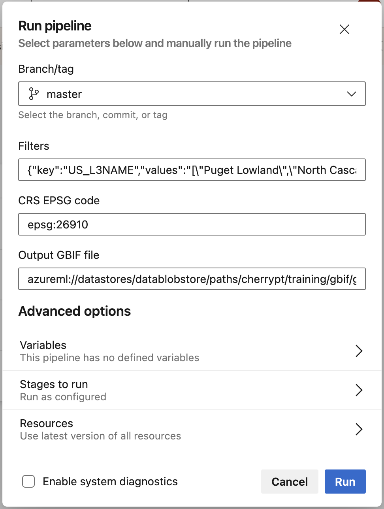
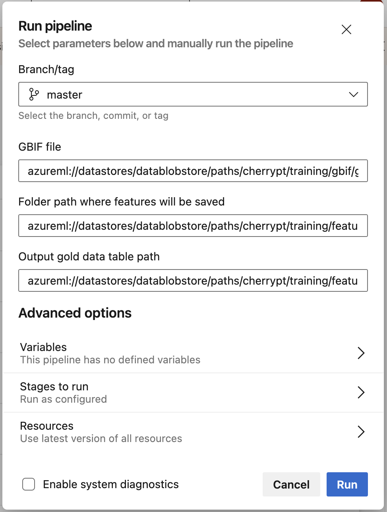
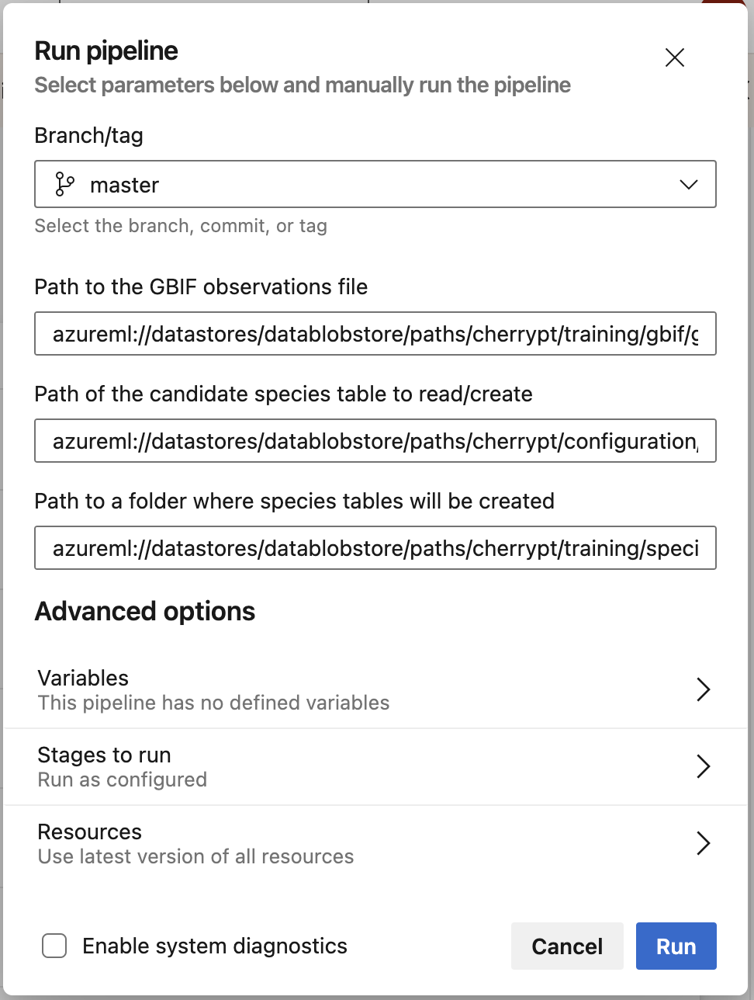
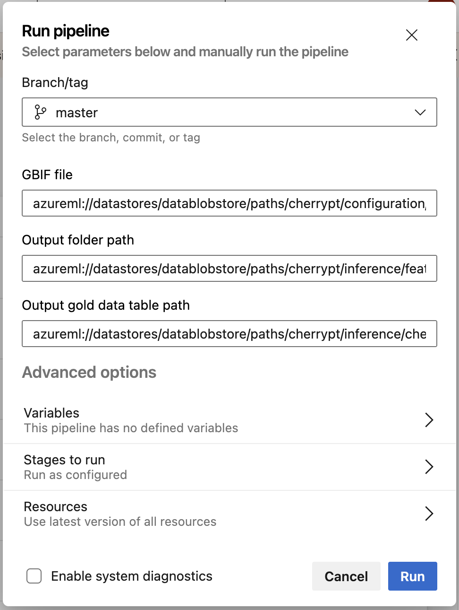
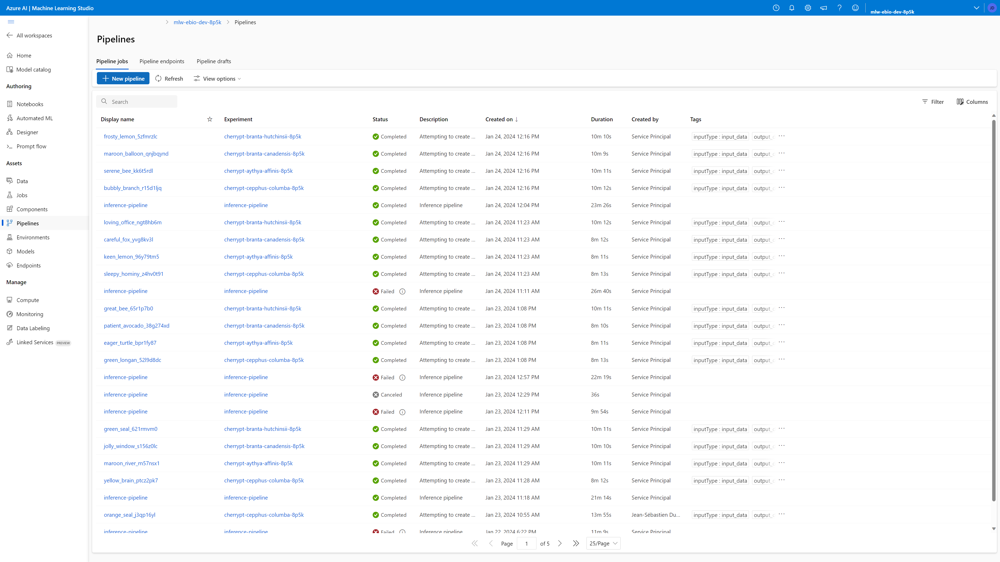
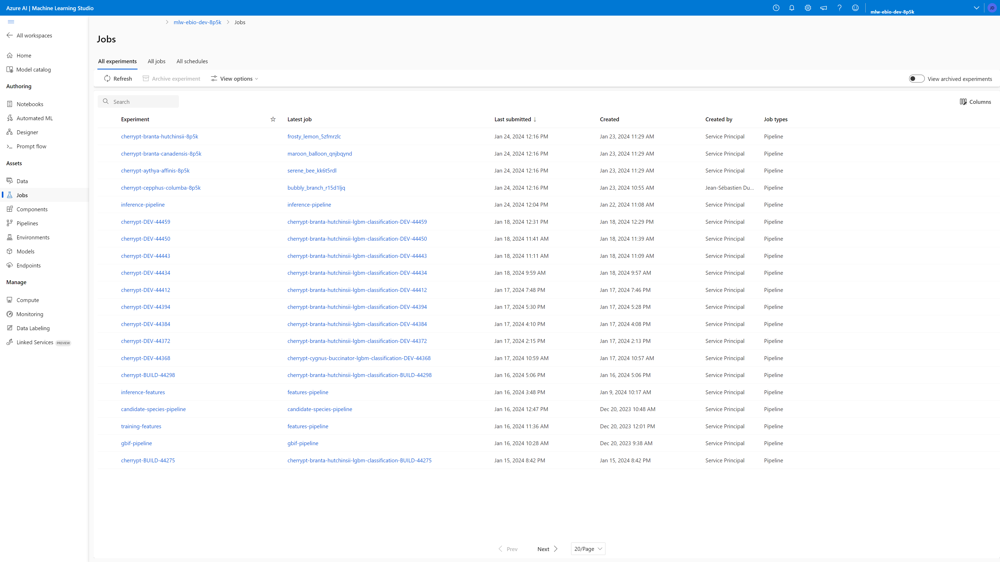
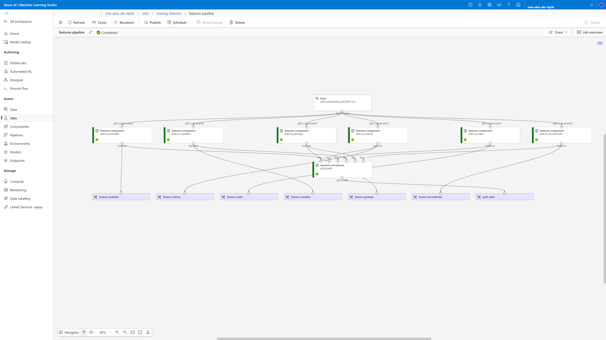
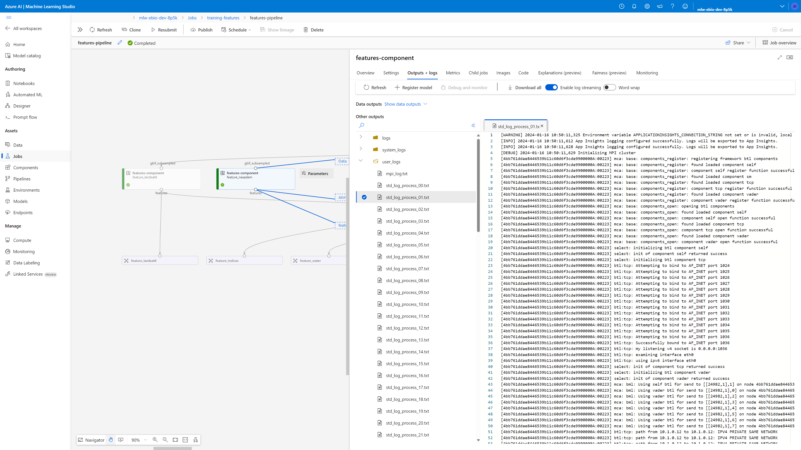

# Data Preparation - Pipelines Execution

[[_TOC_]]

The pipelines can be executed from the Azure DevOps instance, which gives an interface where parameters can be entered and the pipeline can be triggered.

The source YAML files for the data preparation DevOps pipelines are stored in the repo at this location: `.pipelines/dataprep`.

## [Data] 1. Get GBIF : `run-gbif-pipeline`

You will want to run this pipeline as a first step to download an updated data set for training.

Click on `[Data] 1. Get GBIF`, then click on the "Run pipeline" button at the top right of the page.

A form will appear where you can enter the parameters for the pipeline.

**Filters** sets the various spatial filters applied to the data. It is a JSON representation containing the following:

- `key`: the key to use when filtering using US EPA ecoregions attributes. For example, `US_L3NAME`.
- `values`: the values to use when filtering using US EPA ecoregions attributes. For example, `[\"Puget Lowland\",\"North Cascades\"]`.
- `stateprovince`: the value to use when reading the Parquet file, to filter on the `stateprovince` column. For example, `Washington`.

**CRS EPSG code** Use this parameter to set the CRS (Coordinate Reference System) corresponding to the area of study. For example, `epsg:26910` for NAD83 / UTM zone 10N.

**Output GBIF file** is the name of the gold data CSV file that will be created, e.g. the path to `gbif_subsampled.csv`.

You should use a unique name for the output paths, for example by appending a timestamp like `_20230201`.

Click on **Run** to execute the pipeline.

When the Azure DevOps pipeline has completed, the Azure ML pipeline called `gbif-pipeline` is started. You can the switch to the Azure ML pipelines view to monitor its execution.

## [Data] 2. Extract features : `run-features-pipeline`

You will want to run this pipeline as the second step to download an updated data set for training.

> NOTE: this is a long running pipeline that will take at least 15 to 20 hours to complete.

Click on `[Data] 2. Extract features`, then click on the "Run pipeline" button at the top right of the page.

A form will appear where you can enter the parameters for the pipeline.

**GBIF file** points to the GBIF file generated by the previous pipeline, e.g. the path to `gbif_subsampled.csv`.

**Output folder path** is the name of the folder where feature files will be stored.

**Output gold data table path** is the name of the gold data CSV file that will be created, e.g. the path to `features_gold_data_table.csv`.

You should use a unique name for the output paths, for example by appending a timestamp like `_20230201`.

Click on **Run** to execute the pipeline.

When the Azure DevOps pipeline has completed, the Azure ML pipeline called `features-pipeline` is started. You can the switch to the Azure ML pipelines view to monitor its execution.

## [Data] 3. Candidates species: `run-candidate-species-pipeline`

To download an updated data set for training, you should run this pipeline as the third step.

Click on `[Data] 3. Candidates species`, then click on the "Run pipeline" button at the top right of the page.

A form will appear where you can enter the parameters for the pipeline.

**Path to the GBIF observations file** points to the GBIF file generated by the previous pipeline, e.g. the path to `gbif_subsampled.csv`.

**Path of the candidate species table to read/create** points to the list of species of interest for the site, e.g. `candidate_species.csv`.

**Path to a folder where species tables will be created** is the path to an output folder where the per-species tables will be created, e.g. `species`.

You should use a unique name for the output paths, for example by appending a timestamp like `_20230201`.

Click on **Run** to execute the pipeline.

When the Azure DevOps pipeline has completed, the Azure ML pipeline called `candidate-species-pipeline` is started. You can the switch to the Azure ML pipelines view to monitor its execution.

## [Data] 4. Extract inference features : `run-inference-features-pipeline`

You will want to run this pipeline in order to download an updated data set for inference.

Click on `[Data] 4. Extract inference features`, then click on the "Run pipeline" button at the top right of the page.

A form will appear where you can enter the parameters for the pipeline.

**GBIF file** points to the segments file for the site, e.g. the path to `cherry_pt_segments_60m_60m_2013_2021.csv`.

**Output folder path** is the name of the folder where feature files will be stored.

**Output gold data table path** is the name of the gold data CSV file that will be created, e.g. the path to `cherry_pt_gold.csv`.

You should use a unique name for the output paths, for example by appending a timestamp like `_20230201`.

Click on **Run** to execute the pipeline.

When the Azure DevOps pipeline has completed, the Azure ML pipeline called `features-pipeline` is started. You can the switch to the Azure ML pipelines view to monitor its execution.

## Monitoring pipelines in Azure ML

To monitor running jobs, you can utilize the **Pipelines** or **Jobs** view in Azure Machine Learning, as shown in the example below.

Click on the `Display name` to access an overview of the pipeline with its different jobs.

Double-click on a job box to open the detailed job page. You can use the `Maximize panel` button to expand the page.

From that page, you see all input and output parameters, the command being executed, etc.

You can also access the job logs directly, in the "Outputs + logs" tab.

For jobs that use Dask to distribute tasks across multiple machines, there will be many logs in the `user_logs` folder: one per machine in the cluster.

The most useful log is `user_logs/std_log_process_01.txt`, since it is the log for the MPI master node. All the messages written by the script will appear in that log.

