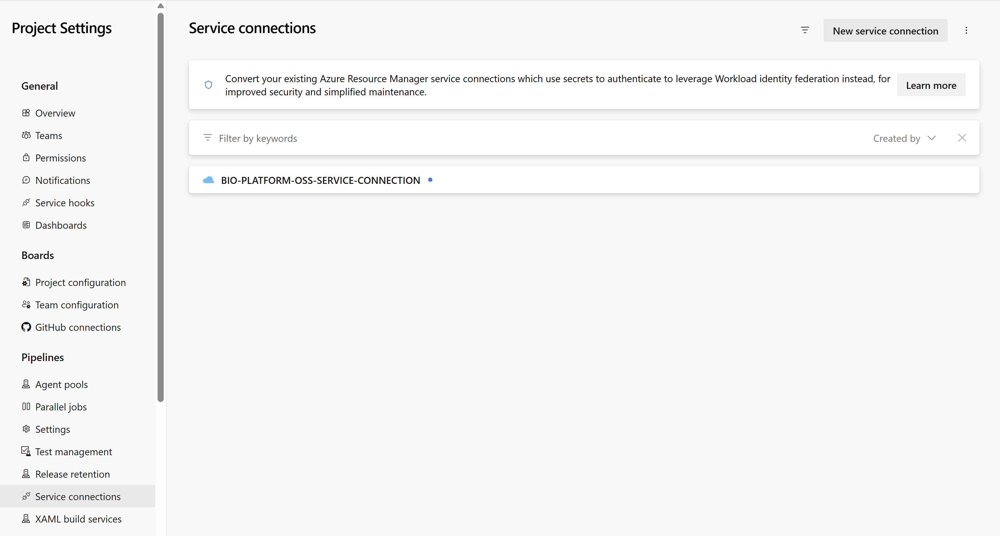
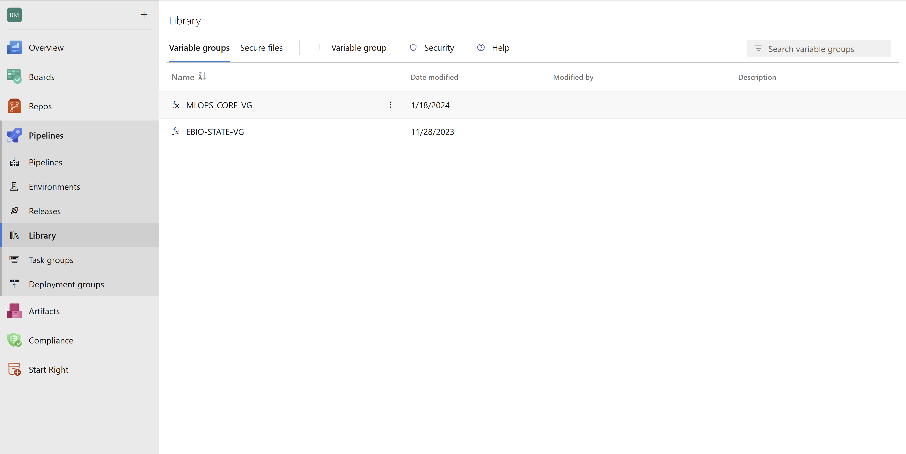
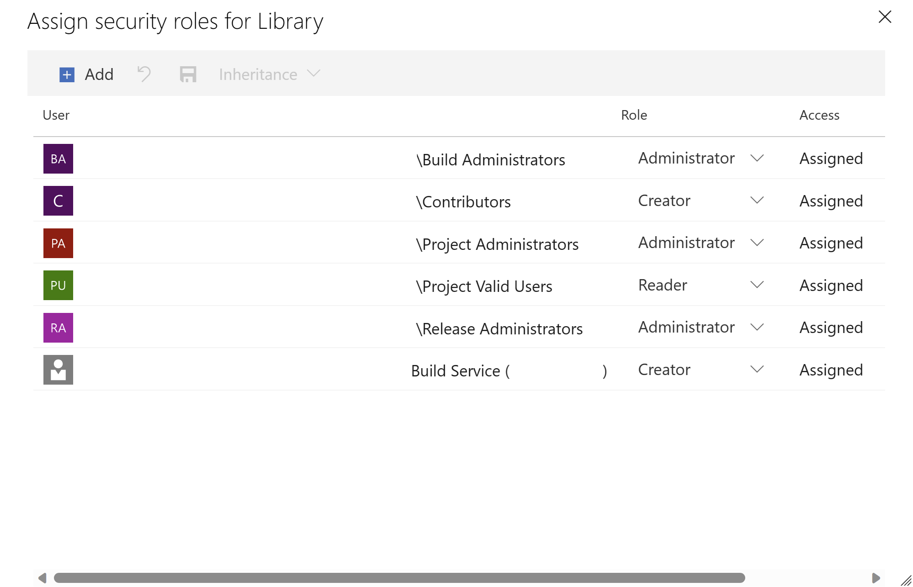
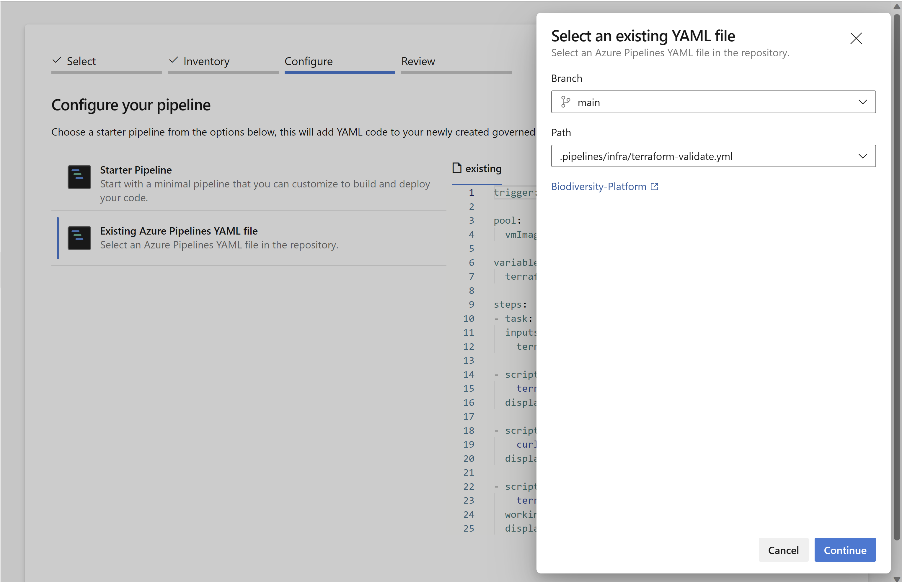
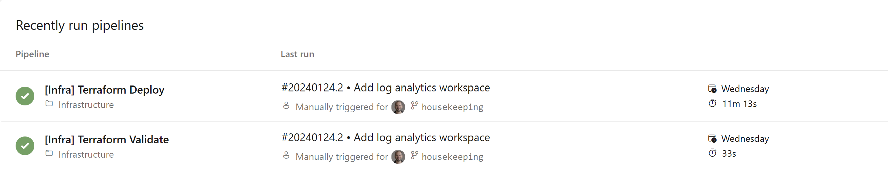
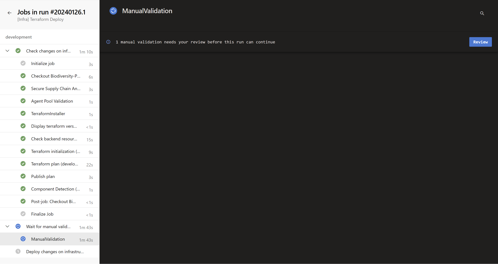
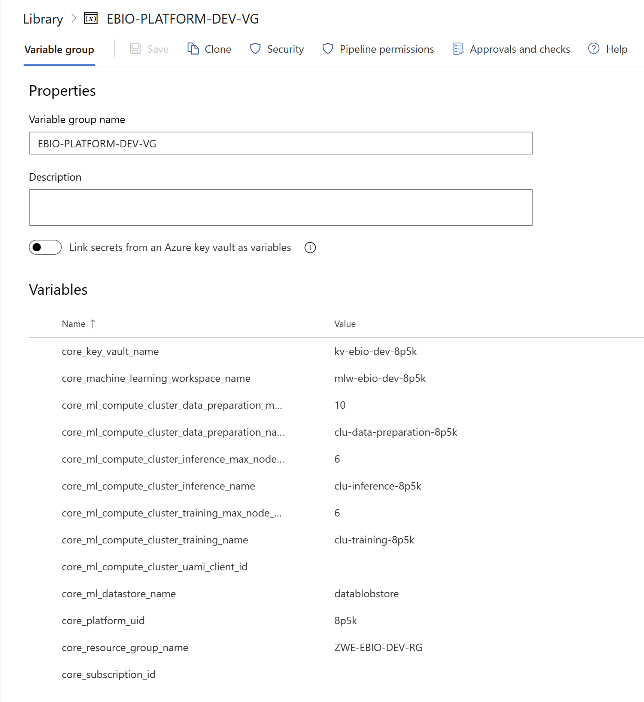

# Infrastructure - Getting Started

## Deploy Infrastructure

1. Service Connection

To deploy Azure resources, make sure you have a valid `service connection` in the project settings section of Azure DevOps. Ideally, the service principal used for the service connection should have `Owner` permissions at the subscription level. This is important because we will be creating resource groups and assigning permissions using infrastructure as code (IaC).

You will have the option to name this connection as **BIO-PLATFORM-OSS-SERVICE-CONNECTION**, but feel free to choose a different name if you prefer.

For more information on how to add a service connection, you can refer to the [Connect to Microsoft Azure with an ARM service connection](https://learn.microsoft.com/en-us/azure/devops/pipelines/library/connect-to-azure?view=azure-devops) documentation.

1. Library (Variables Groups)

Please add the following variable groups in pipelines|library section of Azure DevOps:

The variable group **EBIO-STATE-VG** will contain the service connection name and default values for the terraform state location. It is important to ensure that the value of AZURE_RM_SVC_CONNECTION matches the one set up in the previous step.

| Name | Value |
|------|-------|
| AZURE_RM_SVC_CONNECTION| BIO-PLATFORM-OSS-SERVICE-CONNECTION |
| CONTAINER_NAME | tfstate |
| LOCATION | westeurope |
| RESOURCE_GROUP_NAME | ZWE-EBIO-STATE-RG |
| STORAGE_ACCOUNT_NAME | stebiostate |

The variable group **MLOPS-CORE-VG** will contain default values for Azure ML environment names and the location of conda configuration files.

| Name | Value |
|------|-------|
| AZDO_PIPELINE_REST_VERSION | 7.2-preview.1 |
| ENV_BASE_IMAGE_NAME | mcr.microsoft.com/azureml/openmpi3.1.2-ubuntu18.04 |
| MLOPS_CONDA_PATH | ./mlops/biodiversity/environment/conda.yml |
| MLOPS_ENVIRONMENT_NAME | mlops |
| ORG_NAME | |
| PREPARATION_CONDA_PATH | ./products/biodiversity/dataprep/azureml/conda-dask-mpi-pinned.yml |
| PREPARATION_ENVIRONMENT_NAME | preparation |
| REGISTER_PIPELINE_ID | |
| REGISTER_PIPELINE_REVISION | |

No updates are required for these values, but please note that some values are left blank. The ORG_NAME should contain your Azure DevOps organization name. We will configure the remaining values later.

For more information on how to create a variable group, you can refer to the [Add & use variable groups](https://learn.microsoft.com/en-us/azure/devops/pipelines/library/variable-groups?view=azure-devops&tabs=classic#create-a-variable-group) documentation.

1. Library (Security)

To access the `Assign security roles for Library` popup window, please navigate to the Library interface and click on the `Security` button.

In the Library interface, you will notice that certain roles are already set up. Your attention should be on the Build Service role, which is likely the last one. Modify the default role to "Creator". This particular identity will be responsible for executing the pipelines and will have the necessary permissions to create/update variable groups.

The Infrastructure-as-Code pipeline will create a variable group called **EBIO-PLATFORM-DEV-VG**.

For more information on security model used by assets in the Library, you can refer to the [Library security](https://learn.microsoft.com/en-us/azure/devops/pipelines/library/?view=azure-devops#library-security) documentation.

1. Pipelines

Import infrastructure pipelines using the `New pipeline` button in Azure Pipelines. To configure the pipeline, select `Existing Azure Pipelines YAML file` and choose the appropriate branch. Then, select the file `.pipelines/infra/terraform-validate.yml` as shown in the provided screenshot.

To continue with the steps, you can use the assistant wizard and consider naming this pipeline as `[Infra] Terraform Validate`. It is recommended to place this pipeline inside the `Infrastructure` folder.

You can do the same operations for the deployement pipeline `[Infra] Terraform Deploy`.

| Name | Folder | Path |
|------|--------|------|
| [Infra] Terraform Validate | Infrastructure | .pipelines/infra/terraform-validate.yml |
| [Infra] Terraform Deploy | Infrastructure | .pipelines/infra/terraform-deploy.yml |

To deploy the necessary infrastructure to your subscription, you have now two pipelines available. The first pipeline validates the format of the Terraform configuration files, and the second pipeline handles the deployment of the infrastructure. You can trigger them manually.

> During the first execution of the `[Infra] Terraform Deploy` pipeline, it is necessary to grant permission access to a variable group. Please ensure that you check the pipeline run and grant the required access.

> The pipeline requires manual validation. After the initial job, carefully review the terraform plan step and then proceed with approving or resuming the manual validation process.

After deploying your infrastructure, you will have access to a new variable group named **EBIO-EPLATFORM-DEV-VG**.

1. Keys

To successfully run the data preparation and MLOps pipelines, you need to provide two additional keys that are not automatically retrieved by the Infrastructure-as-Code (IaC) process:

- Azure DevOps Personal Access Token (PAT)
- Planetary Computer Subscription Key

For instructions on how to request and store the required keys, please consult the [Keys and Tokens](keys.md) documentation.

## Additonnal resources

- [Infrastructure Schema](infrastructure.md)
- [Configuration files using Terraform](terraform.md)
- [Pipelines](infra-pipelines.md)
