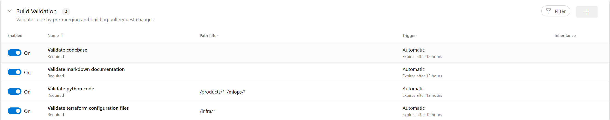

# Pipelines

If you are unfamiliar with the Terraform CLI, it is recommended to read the following references:

- [Initializing Working Directories](https://developer.hashicorp.com/terraform/cli/init)
- [Provisioning Infrastructure with Terraform](https://developer.hashicorp.com/terraform/cli/run)

## terraform-validate

To ensure the quality of code changes, it is recommended to trigger this pipeline using the [Build Validation](https://learn.microsoft.com/en-us/azure/devops/repos/git/branch-policies?view=azure-devops&tabs=browser#build-validation) branch policy. By setting this policy, any pull request changes must pass the build process before the pull request can be completed.



### Yaml

```yaml
trigger: none

pool:
  vmImage: ubuntu-latest

variables:
  terraformDirectory: $(Build.SourcesDirectory)/infra/terraform

steps:
  - task: ms-devlabs.custom-terraform-tasks.custom-terraform-installer-task.TerraformInstaller@0
    inputs:
      terraformVersion: "latest"

  - script: |
      terraform -version
    displayName: "Display terraform version"

  - script: |
      curl -s https://raw.githubusercontent.com/terraform-linters/tflint/master/install_linux.sh | bash
    displayName: "Install tflint"

  - script: |
      terraform fmt -recursive -diff -check
    workingDirectory: $(terraformDirectory)
    displayName: "Check if terraform configuration files are correctly formatted"

  - script: |
      tflint
    workingDirectory: $(terraformDirectory)
    displayName: "Use tflint to detect potential issues"

  - script: |
      terraform init -backend=false
      terraform validate
    workingDirectory: $(terraformDirectory)
    displayName: "Validate terraform configuration files"
```

### Steps

The provided YAML file is a configuration file for Azure Pipelines, a cloud service that you can use to automatically build, test, and deploy your code.

The `pool` section specifies the type of virtual machine to use for the pipeline. In this case, it's set to use the latest version of Ubuntu.

The `variables` section defines a variable `terraformDirectory` that points to the directory where the Terraform files are located.

The `steps` section outlines the sequence of tasks that the pipeline will execute:

1. The first task uses a custom Terraform Installer task to install the latest version of Terraform on the virtual machine.

2. The second task runs a script that displays the installed version of Terraform.

3. The third task installs `tflint`, a linter for Terraform, by downloading and executing a shell script from the [TFLint](https://github.com/terraform-linters/tflint) GitHub repository.

4. The fourth task runs the [terraform fmt](https://developer.hashicorp.com/terraform/cli/commands/fmt) command in the Terraform directory. This command checks if the Terraform configuration files are correctly formatted. The `-recursive` flag tells it to check files in subdirectories as well, the `-diff` flag tells it to display a diff of the changes it would make, and the `-check` flag tells it to not make any changes, only report them.

5. The fifth task runs `tflint` in the Terraform directory to detect potential issues in the Terraform configuration files.

6. The final task runs `terraform init` with the `-backend=false` flag to initialize the Terraform working directory without creating any backend infrastructure, and then runs [terraform validate](https://developer.hashicorp.com/terraform/cli/commands/validate) to validate the Terraform configuration files.

## terraform-deploy

This pipeline is triggered manually, it deploys the infrastructure using Terraform configuration files. The deployment steps are explained in `terraform-deploy-steps` section.

### Yaml

```yaml
trigger: none

pool:
  vmImage: ubuntu-latest

variables:
  - group: EBIO-STATE-VG
  - name: terraformDirectory
    value: $(Build.SourcesDirectory)/infra/terraform
  - name: scriptsDirectory
    value: $(Build.SourcesDirectory)/.pipelines/infra/scripts

stages:
  - stage: development
    jobs:
      - template: terraform-deploy-steps.yml
        parameters:
          environment: development
          location: $(LOCATION)
          resourceGroupName: $(RESOURCE_GROUP_NAME)
          storageAccountName: $(STORAGE_ACCOUNT_NAME)
          storageContainerName: $(CONTAINER_NAME)
          serviceConnection: $(AZURE_RM_SVC_CONNECTION)
```

## terraform-deploy-steps

The pipeline is designed to deploy infrastructure using Terraform in a controlled and validated manner. It ensures that the Terraform configuration files are valid and that the desired changes to the infrastructure are correct before the changes are actually applied. It also allows for manual validation of the Terraform plan before the changes are applied.

### Yaml

```yaml
parameters:
- name: environment
  type: string
  values:
  - development
  - release
- name: location
  type: string
- name: resourceGroupName
  type: string
- name: storageAccountName
  type: string
- name: storageContainerName
  type: string
- name: serviceConnection
  type: string

jobs:
- job: checkinfra
  displayName: 'Check changes on infrastructure (${{parameters.environment}})'
  steps:
  - task: ms-devlabs.custom-terraform-tasks.custom-terraform-installer-task.TerraformInstaller@0
    inputs:
      terraformVersion: 'latest'

  - script: |
      terraform -version
    displayName: 'Display terraform version'

  - task: AzureCLI@2
    displayName: 'Check backend resource requirements to manage terraform states'
    inputs:
      azureSubscription: ${{parameters.serviceConnection}}
      scriptType: bash
      scriptLocation: scriptPath
      arguments: ${{parameters.location}} ${{parameters.resourceGroupName}} ${{parameters.storageAccountName}} ${{parameters.storageContainerName}}
      scriptPath: $(scriptsDirectory)/state-requirements.sh

  - task: AzureCLI@2
    displayName: 'Terraform initialization (${{parameters.environment}})'
    inputs:
      azureSubscription: ${{parameters.serviceConnection}}
      workingDirectory: $(terraformDirectory)
      scriptType: bash
      scriptLocation: inlineScript
      inlineScript: |
        terraform init -upgrade \
          -backend-config="storage_account_name=${{parameters.storageAccountName}}" \
          -backend-config="container_name=${{parameters.storageContainerName}}" \
          -backend-config="access_key=$(az storage account keys list --resource-group ${{parameters.resourceGroupName}} --account-name ${{parameters.storageAccountName}} --query [0].value -o tsv)" \
          -backend-config="key=${{parameters.environment}}.tfstate"

  - task: AzureCLI@2
    displayName: 'Terraform plan (${{parameters.environment}})'
    inputs:
      azureSubscription: ${{parameters.serviceConnection}}
      workingDirectory: $(terraformDirectory)
      addSpnToEnvironment: true
      scriptType: bash
      scriptLocation: inlineScript
      inlineScript: |
        export ARM_TENANT_ID=$tenantId # get tenant id from environment variables
        export ARM_SUBSCRIPTION_ID=$(az account show --query 'id' --output tsv)
        export ARM_CLIENT_ID=$servicePrincipalId # get client id from environment variables
        export ARM_CLIENT_SECRET=$servicePrincipalKey

        terraform plan -var-file="./environments/${{parameters.environment}}.tfvars" -out=$(Build.ArtifactStagingDirectory)/$(Build.BuildId)

  - publish: '$(Build.ArtifactStagingDirectory)'
    displayName: 'Publish plan'
    artifact: ${{parameters.environment}}

- job: waitForValidation
  displayName: 'Wait for manual validation (${{parameters.environment}})'
  dependsOn: checkinfra
  pool: server
  timeoutInMinutes: 1440
  steps:
  - task: ManualValidation@0
    timeoutInMinutes: 120
    inputs:
        instructions: 'Please validate the terraform plan.'
        onTimeout: 'reject'

- job: deployinfra
  displayName: 'Deploy changes on infrastructure (${{parameters.environment}})'
  dependsOn: waitForValidation
  steps:
  - download: current
    displayName: 'Download plan'
    artifact: ${{parameters.environment}}

  - task: ms-devlabs.custom-terraform-tasks.custom-terraform-installer-task.TerraformInstaller@0
    inputs:
      terraformVersion: 'latest'

  - script: |
      terraform -version
    displayName: 'Display terraform version'

  - task: AzureCLI@2
    displayName: 'Terraform initialization (${{parameters.environment}})'
    inputs:
      azureSubscription: ${{parameters.serviceConnection}}
      workingDirectory: $(terraformDirectory)
      scriptType: bash
      scriptLocation: inlineScript
      inlineScript: |
        terraform init -upgrade \
          -backend-config="storage_account_name=${{parameters.storageAccountName}}" \
          -backend-config="container_name=${{parameters.storageContainerName}}" \
          -backend-config="access_key=$(az storage account keys list --resource-group ${{parameters.resourceGroupName}} --account-name ${{parameters.storageAccountName}} --query [0].value -o tsv)" \
          -backend-config="key=${{parameters.environment}}.tfstate"

  - task: AzureCLI@2
    displayName: 'Terraform apply (${{parameters.environment}})'
    inputs:
      azureSubscription: ${{parameters.serviceConnection}}
      workingDirectory: $(terraformDirectory)
      addSpnToEnvironment: true
      scriptType: bash
      scriptLocation: inlineScript
      inlineScript: |
        export ARM_TENANT_ID=$tenantId # get tenant id from environment variables
        export ARM_SUBSCRIPTION_ID=$(az account show --query 'id' --output tsv)
        export ARM_CLIENT_ID=$servicePrincipalId # get client id from environment variables
        export ARM_CLIENT_SECRET=$servicePrincipalKey

        terraform apply -auto-approve $(Pipeline.Workspace)/${{parameters.environment}}/$(Build.BuildId)

  - task: Bash@3
    displayName: 'Update variable group using terraform outputs'
    inputs:
      targetType: filePath
      arguments: $(System.TeamFoundationCollectionUri) $(System.TeamProjectId) "EBIO-PLATFORM-DEV-VG"
      workingDirectory: $(terraformDirectory)
      filePath: $(scriptsDirectory)/update-variablegroup.sh
    env:
      AZURE_DEVOPS_EXT_PAT: $(System.AccessToken)
```

### Steps

The provided YAML file is a configuration file for Azure Pipelines. It defines a pipeline with three jobs: `checkinfra`, `waitForValidation`, and `deployinfra`.

1. The `checkinfra` job checks changes on the infrastructure for a specific environment. It installs the latest version of Terraform, displays the installed version, checks backend resource requirements to manage Terraform states, initializes Terraform, creates a Terraform plan, and publishes the plan as an artifact of the build.

2. The `waitForValidation` job waits for manual validation of the Terraform plan. It depends on the `checkinfra` job, meaning it will only run after `checkinfra` has completed successfully. The job waits for up to 120 minutes for manual validation. If no validation is received within this time, the job is rejected.

3. The `deployinfra` job deploys changes on the infrastructure for a specific environment. It also depends on the `waitForValidatio`n job, meaning it will only run after `waitForValidation` has completed successfully. The job downloads the Terraform plan created by the `checkinfra` job, installs the latest version of Terraform, displays the installed version, initializes Terraform, applies the Terraform plan, and updates a variable group using Terraform outputs.
