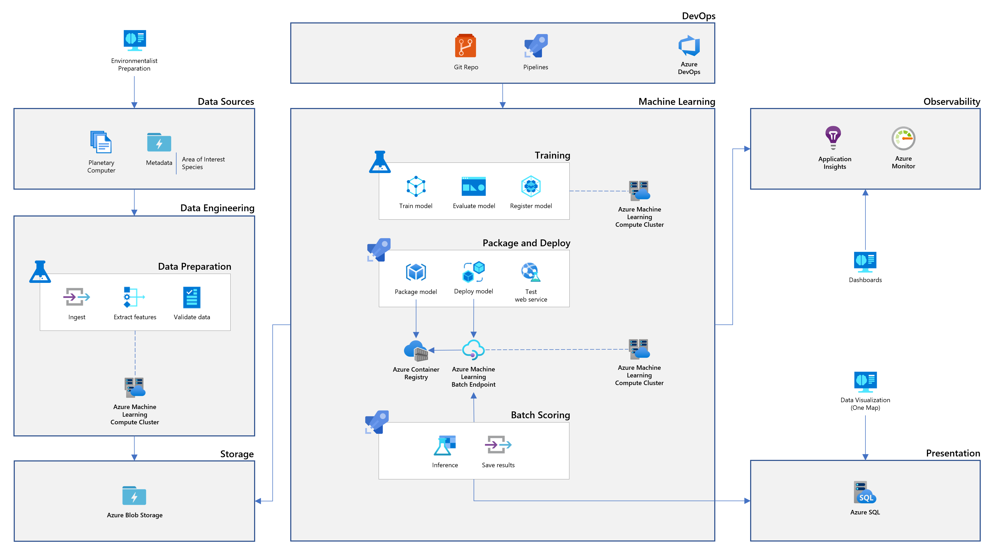

# Infrastructure

## Resources

The solution is mainly built on top of [Azure Machine Learning](https://learn.microsoft.com/en-us/azure/machine-learning/overview-what-is-azure-machine-learning) and usage of the following resources and services:

### Fundamentals

- [Application Insights](https://learn.microsoft.com/en-us/azure/azure-monitor/app/app-insights-overview)
  - Application Insights is an extension of Azure Monitor and provides Application Performance Monitoring (also known as “APM”) features.
- [Azure Key Vault](https://learn.microsoft.com/en-us/azure/key-vault/general/basic-concepts)
  - Azure Key Vault is a cloud service for securely storing and accessing secrets.
- [Azure Container Registry](https://learn.microsoft.com/en-us/azure/container-registry/container-registry-intro/)
  - Azure Container Registry is a managed registry service based on the open-source Docker Registry 2.0.

### Data Storage

- [Microsoft Planetary Computer](https://planetarycomputer.microsoft.com/docs/overview/about)
  - The Microsoft Planetary Computer is a platform that lets users leverage the power of the cloud to accelerate environmental sustainability and Earth science. The Planetary Computer Data Catalog includes petabytes of environmental monitoring data, in consistent, analysis-ready formats.
- [Azure Blob Storage](https://learn.microsoft.com/en-us/azure/storage/blobs/storage-blobs-introduction)
  - Azure Blob Storage is Microsoft's object storage solution for the cloud. Blob Storage is optimized for storing massive amounts of unstructured data.

### Linked to Azure Machine Learning

- [Azure Machine Learning workspace](https://learn.microsoft.com/en-us/azure/machine-learning/concept-workspace)
  - The workspace is the top-level resource for Azure Machine Learning, providing a centralized place to work with all the artifacts you create when you use Azure Machine Learning. The workspace keeps a history of all training runs, including logs, metrics, output, and a snapshot of your scripts. You use this information to determine which training run produces the best model.
- [Azure Machine Learning pipelines](https://learn.microsoft.com/en-us/azure/machine-learning/concept-ml-pipelines)
  - An Azure Machine Learning pipeline is an independently executable workflow of a complete machine learning task. An Azure Machine Learning pipeline helps to standardize the best practices of producing a machine learning model, enables the team to execute at scale, and improves the model building efficiency.
- [Azure Machine Learning compute (managed)](https://learn.microsoft.com/en-us/azure/machine-learning/concept-compute-target#azure-machine-learning-compute-managed)
  - Cluster of virtual machines on-demand with automatic scaling and GPU and CPU node options. The data preparation, training and inference jobs are executed on these resources.
- [Azure Machine Learning batch endpoint](https://learn.microsoft.com/en-us/azure/machine-learning/concept-endpoints#what-are-batch-endpoints)
  - Batch endpoints are endpoints that are used to do batch inferencing on large volumes of data over a period of time. Batch endpoints receive pointers to data and run jobs asynchronously to process the data in parallel on compute clusters.

### Azure DevOps

- [Azure Pipelines](https://learn.microsoft.com/en-us/azure/devops/pipelines/get-started/what-is-azure-pipelines?view=azure-devops)
  - Azure Pipelines automatically builds and tests code projects. It supports all major languages and project types and combines continuous integration, continuous delivery, and continuous testing to build, test, and deliver your code to any destination.

### Compute Cluster

[Azure Machine Learning compute cluster](https://learn.microsoft.com/en-us/azure/machine-learning/how-to-create-attach-compute-cluster?tabs=python#what-is-a-compute-cluster) is a managed-compute infrastructure that allows you to easily create a single or multi-node compute. The compute cluster is a resource that can be shared with other users in your workspace. The compute scales up automatically when a job is submitted, and can be put in an Azure Virtual Network.

#### Managed identity

A user-assigned managed identity is created and shared by all compute clusters, objective is to simplify permissions assignments. See [Set up authentication between Azure Machine Learning and other services](https://learn.microsoft.com/en-us/azure/machine-learning/how-to-identity-based-service-authentication#compute-cluster) reference for additional information.

This identity is used:

- To access `Key Vault` secrets with **get, list** permissions
- To access `Azure Machine Learning Workspace` scope with `Azure AI Developer` custom role assignment. This role provides some additional privileges needed to read/write batch deployment operations.
