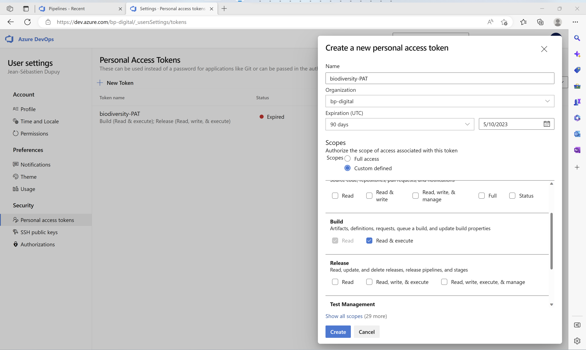
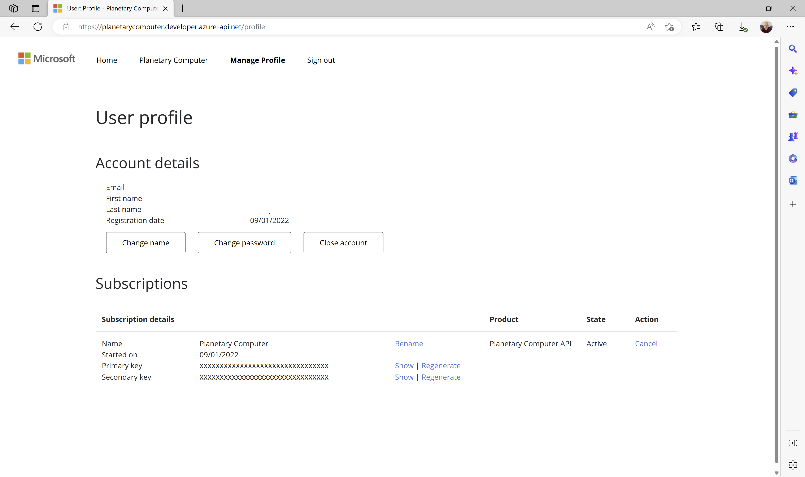

# Keys and Tokens

## Azure DevOps Personal Access Token

### About PATs

A `personal access token` contains your security credentials for Azure DevOps. A PAT identifies you, your accessible organizations, and [scopes](https://learn.microsoft.com/en-us/azure/devops/integrate/get-started/authentication/oauth?view=azure-devops#scopes) of access. As such, they're as critical as passwords, so you should treat them the same way.

> This `personal access token` (PAT) must be stored in the key vault.

[Use personal access tokens](https://learn.microsoft.com/en-us/azure/devops/organizations/accounts/use-personal-access-tokens-to-authenticate)

### Context

Once the training step is completed on Azure Machine Learning, it will automatically triggers an Azure DevOps pipeline to register/publish the model. This callback mechanism needs an identity, and PAT is a simple and convenient way to do it.

> Only `build (read & execute)` scopes are granted to limit token access.

### Create a PAT

The steps to create a PAT are listed in the following [article](https://learn.microsoft.com/en-us/azure/devops/organizations/accounts/use-personal-access-tokens-to-authenticate#create-a-pat).

Limit scopes only to `build (read & execute)`. Make sure you copy the token once you create it. You will not be able to see it again.

The token must be then copied into the Key Vault with **DEVOPS-PIPELINE-PAT** name (just update the current value).

## Planetary Computer Subscription Key

### Context

[Using Tokens for Data Access](https://planetarycomputer.microsoft.com/docs/concepts/sas/)

The STAC metadata API is available to all users and does not require an account or a token to use. While all data assets require a token for accessing files on Azure Blob storage, some datasets also require an account key to be used when generating the token. This requirement is indicated on the Data Catalog page of affected datasets. For these datasets, be sure to include your Planetary Computer subscription key when requesting a token, as described below.

In addition, rate limiting and token expiry are dependent on two aspects of each requests:

- Whether or not the request is originating from within the same data center as the Planetary Computer service (West Europe)
- Whether or not a valid API subscription key has been supplied on the request

These two variables are used to determine the tier of rate limiting which is applied to requests, as well as the valid length of time for issued SAS tokens. **For the most un-throttled access, we recommend utilizing a Planetary Computer subscription key and doing your work in the West Europe Azure region.**

### Supplying a subscription key

When your Planetary Computer [account request](http://planetarycomputer.microsoft.com/account/request) was approved, a pair of subscription keys were automatically generated for you. You can view your keys by signing in to the [developer portal](https://planetarycomputer.developer.azure-api.net/).

The primary key must be then copied into the Key Vault with **PC-SDK-SUBSCRIPTION-KEY** name (just update the current value).
