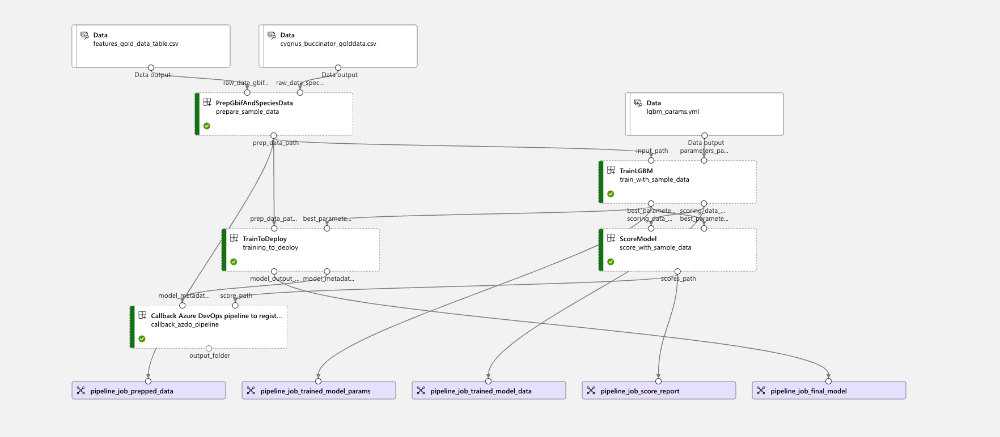

# MLOps - Register Models Pipeline (Callback)

[[_TOC_]]

This document explains the functionality of the callback stage, which performs the following processes:

- Model registration in Azure Machine Learning
- Endpoint creation
- Batch deployment


## Code Structure

```tree
|
|-- .pipelines
|   |-- mlops
|       |-- ci_dev_register_pipeline.yml
|-- mlops
|   |-- biodiversity
|       |-- src
|           |-- mlops_pipeline.py
|           |-- batch_deployment.py
|           |-- register_model.py
|           |-- azdo_callback_pipeline.py
|-- products
|       |-- biodiversity
|           |-- src
|               |-- mlops
|                   |-- scoring_src
|                       |-- scoring.py
```

## Sample MLOps Run



## Execution

The callback stage is called once the MLOps pipeline has finished executing successfully. It is the last stage of the pipeline, called `Callback Azure DevOps pipeline to register model`. It uses as inputs `model_metadata`, which contains the `runuri` and `runid`. These are used to uniquely identify the run and the MLFlow model to be registered.

It also uses the `scores_path`, so that the **accuracy** and **roc_auc** can be retrieved to track model performance. This stage gets called only when the `wait_for_completion` variable is set to `False`. When the value is set to `True` the box corresponding to the callback stage will not even appear in AzureML.

The callback stage calls the callback pipeline, which is defined directly in the `mlops_pipeline.py` file (lines 114-142) and does not have a dedicated `.yml` file. It is defined using the `command` function from the `azure.ai.ml` library. In this command there are several configurable parameters of high importance such as:

- `command` - the BASH command that calls `azdo_pipeline_callback.py` - this has been kept as one long line since using other methods such as triple quoting (""") would result in parsing errors for the BASH script, as new rows would be read as new commands instead of a continuation of the first
- `environment_variables` - defines execution variables such as the PYTHONPATH, important for relative imports
- `environment` - reference to the AzureML environment used
- `inputs` -  all the variables used as inputs for the pipeline

The pipeline is triggered in the `mlops_species` function and it executes the code in `azdo_pipeline_callback.py`. In this python file a request is sent to the registration and batch deployment pipeline which is defined in `ci_dev_register_pipeline.yml`. This then calls the code in the `register_model.py` and `batch_deployment.py` files.

## Configuration Files

The only configuration file in this process is `ci_dev_register_pipeline.yml`. By calling on this file a pipeline is created in Azure DevOps that has the following stages:

### ApprovalRequired

This stage involves manually approving the registration of the model. This is done in order to prevent performance regression by checking whether the performance of the new model is an improvement over the older one. Metrics for the model can be read in the `Pipeline parameters` section of the `Approval Required` stage in the pipeline.


### RegisterModelAndBatchDeployment

This stage depends on the successful manual approval of the user. If the user does not provide the approval the pipeline will abort and execution will be stopped. There are several steps in this stage:

- `UsePythonVersion` - specifies the version of Python to be used
- `Install Job Requirements` - called by the `template` step, which uses the script from `.pipelines/mlops/templates/configure_azureml_agent.yml`, the same as in `ci_dev_pipeline.yml`
- `Register the Model` - performs the model registration by calling the `register_model.py` files. The line before the python file is called `source $(Build.SourcesDirectory)/python-path.env; export PYTHONPATH` is used to make sure that relative imports will work in AzureML
- `Batch Deployment` - creates and endpoint and a batch deployment by calling the `batch_deployment.py` file

## Scripts

### azdo_pipeline_callback.py

This stage collects the `run_id` and `run_uri` from the output of the `training_to_deploy` component, `training_to_deploy.outputs.model_output_path`. It also collects the **accuracy** and **roc_auc** metrics for tracking model performance from the `score_with_sample_data` component, `score_with_sample_data.outputs.scores_path`. These are then aggregated in a JSON request that is sent to the registration and batch deployment pipeline. The url of the pipeline is generated by using several parameters specific to the pipeline. If the request returns anything but a **200** message then the stage is failed. If the **200** message is received it means that the pipeline has started executing, but it is not a guarantee of successful execution. That has to be checked in AZDO.

### register_model.py

This stage performs the model registration. The name of the model will be the `experiment_base_name` variable, followed by `-model`. The `experiment_base_name` is defined in `mlops_pipeline.py` and is comprised of `{site_name}-{species-name}`. The model is then defined as a MLFlow model and the accuracy, roc_auc and trigger_buildid are specified as parameters for better model tracking. The model is then registered and can be found in Azure ML. Several images showing how it is displayed can be found below. The model path that is used for the model registration is the `runuri`.


This is a list of all the models registered in Azure ML. Here you can observe the version of each model and some key metrics.


By clicking on a model name you open up a page where more details are provided for the current version of the model.


Clicking the versions tab will display all the previous version of the model. Each version can be reused by specifying the version you want to use when specifying the deployment details.


The Artifacts tab contains all the files saved by MLFLow.

### batch_deployment.py

This script creates a batch endpoint and a batch deployment using a custom scoring script.

A model is first selected to perform the deployment with. This is done by using the model name to retrieve the model from Azure ML. Then the latest version of the model is selected. Any valid version can be selected by specifying the desired version in the `version` parameter of the `ml_client.models.get` function.

The next step is slicing the name of the endpoint and the batch deployment to 32 characters. This is done because a service can be named with a name of maximum 32 character, that contains only alphanumerical characters and dashes (-).

The endpoint is then created and a conda environment is specified. This also originates from `MLOPS-CORE-VG`. The next configured variable is `code_configuration`. The path provided in the `code` parameter indicates all the folders that will be uploaded to the execution environment. In this step the **scoring script** is provided. More details regarding the scoring will be provided at the end of the document.

The batch deployment is then configured using the `BatchDeployment` `azure.ai.ml` entity. This step contains several important parameters:

- `name` - the same name is used for both the endpoint and the batch deployment
- `model` - the model which will be used in the deployment
- `environment` - conda environment to be used
- `environment_variables` - the PYTHONPATH that specifies how relative imports should be done
- `code_configuration` - folders to be uploaded to cloud and the scoring script
- `output_file_name` - name of the file containing the predictions made by the endpoint

The endpoints and batch deployments are called by the inference scripts to make predictions on the inputs. This type of endpoints are called batch since they receive as inputs multiple files for which predictions are made.

### scoring.py

This script handles making predictions on files used for inference. The naming can be ambiguous, but this is how this type of file is named on AzureML as well, so we stuck with the convention.

If you have a model saved in MLFlow you generally do not need a custom scoring script. We are using this scoring script since we are predicting the probabilities for each class, which is not supported automatically. Also, some flavors of models are not supported, such as the one we are using, `lightgbm`, since it uses the [scikit-learn API](https://mlflow.org/docs/latest/models.html#lightgbm-lightgbm).

The `init` function **does not take any arguments**. This function loads the model as a global variable. The model is read from a temporary storage created by the deployment, so no path has to be provided. The name of the directory where the model is saved has to be the same as the one specified in `train_to_deploy.py`, in this case `lgbm_gbif_model`.

The `run` function take as input a list of files for which predictions have to be made. The files are read successively and predictions for each of them are appended to a `results` dataframe which contains the predictions made for all the files in the minibatch. The columns of the results file are as follows: `file`, `predictions_ABSENT`, `predictions_PRESENT`. In the inference step we are using only the probabilities for the **PRESENT** class.

Below are some examples of how a batch endpoint and deployment look like in AzureML.


This page can be accessed by clicking the **Endpoints** tab on the sidebar which is already highlighted. Here you can observe the list of all the active batch endpoints and their date of last update.


By clicking on the name of an endpoint you are redirected to the page an endpoint. Here you can observe the deployments for the endpoint and the deployment details, such as the model used, the path of the scoring script, compute clusters etc.

You can also make a deployment the default one by clicking on **Update default deployment** and selecting the desired deployment. This is useful if you do not want to specify the name of a deployment when invoking a batch endpoint. However, whenever the deployment is updated the default deployment resets, so it would have to be reset to default once more.

## Testing

The `register_model.py` and `batch_deploymet.py` scripts can be tested locally by running the commands in the CLI using the right arguments. First you need to login to AzureML from the CLI, which is done by running the  `az login` command.

Example:

```BASH
python /workspaces/Biodiversity-Platform/mlops/biodiversity/src/batch_deployment.py --subscription_id aaaaaaaa-bbbb-cccc-dddd-eeeeeeeeeeee --resource_group_name zwe-ebio-n-12-dse-dev-rsg --workspace_name mlw-ebio-dev-8fpz --cluster_name clu-training-8fpz --species_name jamaica --model_name cherrypoint_frog_sklearn_lightgbm_DEV --env_base_image_name mcr.microsoft.com/azureml/openmpi3.1.2-ubuntu18.04:latest --conda_path mlops/biodiversity/environment/conda.yml --experiment_base_name cherrypt-jamaica-burteo
```

Most of these values can be taken from the Variable Groups in AZDO. This command will not trigger a pipeline and the successful execution can be observed by checking on AzureML whether new models are registered and deployments are updated.

For the `register_model.py` script all the values for the inputs can be taken from the output logs in the callback stage of the MLOps pipeline, since a real model is needed for registration. This will trigger the `mlops-ci-register` pipeline in AZDO, for which approval is required.
