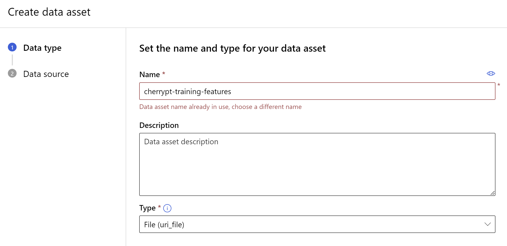
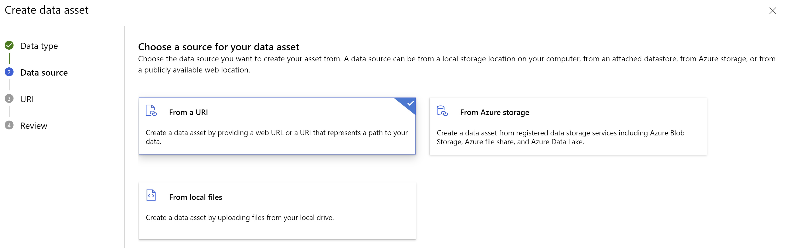
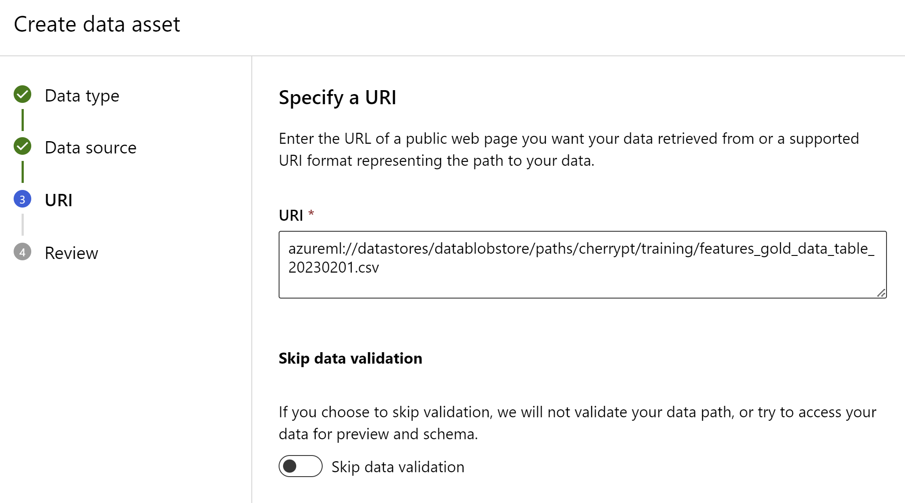
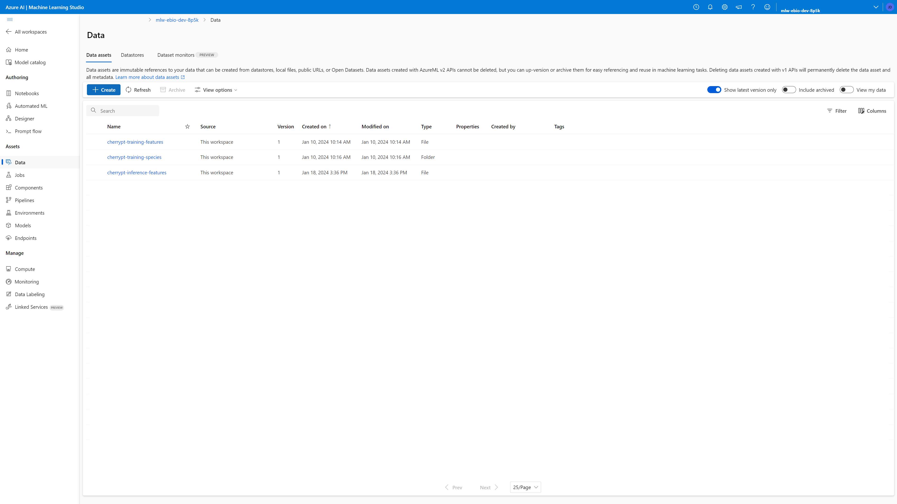
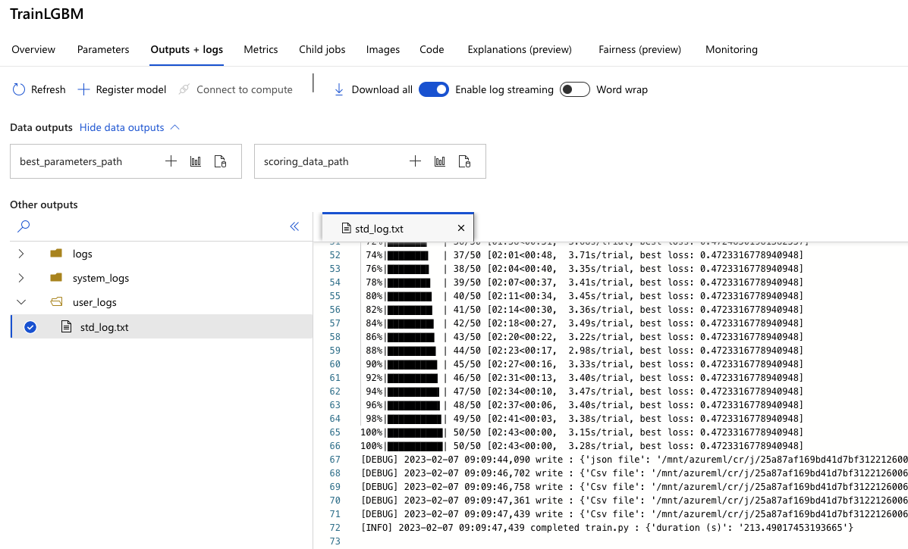
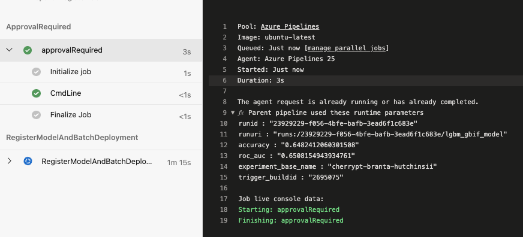
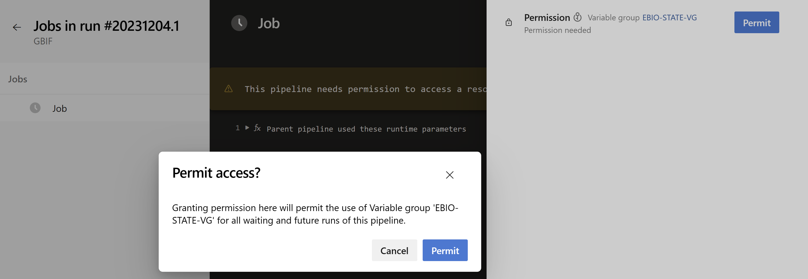

# MLOps - Getting Started

## Import Pipelines

Import MLOps pipelines using the `New pipeline` button in Azure Pipelines. To configure the pipeline, select `Existing Azure Pipelines YAML file` and choose the appropriate branch. Then, select the file `.pipelines/python-validate.yml`.

To continue with the steps, you can use the assistant wizard and consider naming this pipeline as `[MLOps] Build Validation`. It is recommended to place this pipeline inside the `MLOps` folder.

For all MLOps pipelines, you can perform the same operations. Remember to save them, but do not run them yet as some configuration files are missing at this stage.

| Name | Folder | Path |
|------|--------|------|
| [MLOps] Build Validation| MLOps | .pipelines/python-validate.yml |
| [MLOps] Train Models | MLOps | .pipelines/mlops/ci_dev_pipeline.yml |
| [MLOps] Register Models | MLOps | .pipelines/mlops/ci_dev_register_pipeline.yml |
| [MLOps] Inference | MLOps | .pipelines/mlops/execute_inference.yml |

## Creating Data Assets

Once the [data preparation](../dataprep/dataprep-getting-started.md) pipelines have been run, a new set of data files can be registered as data assets, so that the ML pipelines can use them without having to edit the data paths in the pipeline or the code.

For reference, the Azure ML pipelines are set up to use the following data assets:

- `mlops-ci-dev`
  - `cherrypt-training-features` points to the gold features data file, e.g. `features_gold_data_table_20230130.csv`. It will pick up the latest version.
  - `cherrypt-training-species` points to the folder where the species data files are stored, e.g. `species_20230130`. It will pick up the latest version.
- `execute-inference`
  - `cherrypt-inference-features` points to the Cherry Point gold dataset, e.g. `cherry_pt_gold_20230130.csv`. You can specify the data asset version to use in the form.

Here is the process to register a new data asset:

1. In Azure Machine Learning Studio, click `Data` in the left navigation pane.
2. Select `Create` button.
3. Name the asset `cherrypt-training-features` and select `File (uri_file)` type. Be careful with this type for futures assets, it's not always the same.

    

4. Select `Next` button.
5. Choose `From a URI` option.

    

6. Select `Next` button.
7. Copy `azureml://datastores/datablobstore/paths/cherrypt/training/features_gold_data_table_20230201.csv` in the URI text box.

    

8. Review and Create the asset.
9. Repeat the same steps to have the following assets created.

    | Name | Type | URI |
    |------|------|-----|
    | cherrypt-training-features | File (uri_file) | azureml://datastores/datablobstore/paths/cherrypt/training/features_gold_data_table_20230201.csv |
    |cherrypt-training-species | Folder (uri_folder) | azureml://datastores/datablobstore/paths/cherrypt/training/species_20230201/ |
    |cherrypt-inference-features | File (uri_file) | azureml://datastores/datablobstore/paths/cherrypt/inference/cherry_pt_gold_20230201.csv |

    

## Update MLOPS-CORE-VG

Execute the following script to get REGISTER_PIPELINE_ID and REGISTER_PIPELINE_REVISION.

```bash
DEVOPS_ORGANIZATION="http://dev.azure.com/YOUR_ORGANIZATION"
DEVOPS_PROJECT="YOUR_PROJECT"
REGISTER_PIPELINE_NAME="[MLOps] Register Models"

az devops configure --defaults organization="${DEVOPS_ORGANIZATION}" project="${DEVOPS_PROJECT}"
az devops configure --list

register_pipeline_id=$(az pipelines show --name "${REGISTER_PIPELINE_NAME}" --query id --output tsv)
register_pipeline_revision=$(az pipelines show --name "${REGISTER_PIPELINE_NAME}" --query revision --output tsv)

echo "REGISTER_PIPELINE_ID: ${register_pipeline_id}"
echo "REGISTER_PIPELINE_REVISION: ${register_pipeline_revision}"
```

Copy and Paste these values in `MLOPS-CORE-VG` variable group.

## Run Pipelines

For execution of data preparation pipelines, you can run them in the following order.

1. [MLOps] Build Validation

    To ensure the quality of code changes, it is recommended to trigger this pipeline using the [Build Validation](https://learn.microsoft.com/en-us/azure/devops/repos/git/branch-policies?view=azure-devops&tabs=browser#build-validation) branch policy. By setting this policy, any pull request changes must pass the build process before the pull request can be completed.

2. [MLOps] Train Models

    In order to check the status of the pipeline you will have to check the execution of the pipeline in AzureML. The pipeline name will be displayed as `{site_name}-{deployment_environment}-{build_id}`. The **Build ID** is reported in the **Execute Azure ML pipeline job** as a message. In this stage the errors from `prep.py`, `train.py`, `score.py` and `train_to_deploy.py` will be reported, if any. You can check them by looking at the **Outputs + Logs** tab for each stage. In this tab all the outputs from that stage will be provided as well. For some stages, such as **TrainLGBM** and **ScoreModel** metrics are provided in the **Metrics** tab.

    

    The pipeline has multiple jobs, each one for a species. The name of the job will indicate for which species the respective job is. Once all the pipelines finish executing the callbacks are triggered for each model. The most common reason why callbacks might fail is that the personal access token for the pipeline is incorrect or expired. This PAT is retrieved from the **KeyVault**. You need to make sure there is a valid PAT in KeyVault and that the PAT has not expired.

    `[MLOps] Register Models` pipeline will be invoked automatically at the end of the training. You have a manual validation step to accept or reject the model (for each species) before to register it.

    

3. [MLOps] Inference

    Inference results are stored in `azureml://datastores/datablobstore/paths/cherrypt/results`.

> During the first execution of the each pipeline, it is necessary to grant permission access to variable groups. Please ensure that you check the pipeline run and grant the required access.



## Additonnal resources

- [MLOps - Train Models](./mlops-pipeline.md)
- [MLOps - Register Models Pipeline (Callback)](./mlops-callback-pipeline.md)
- [MLOps - Inference](./mlops-inference.md)
- [Observability](./observability.md)

