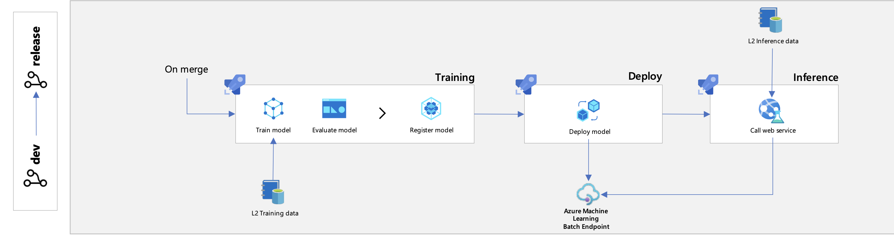
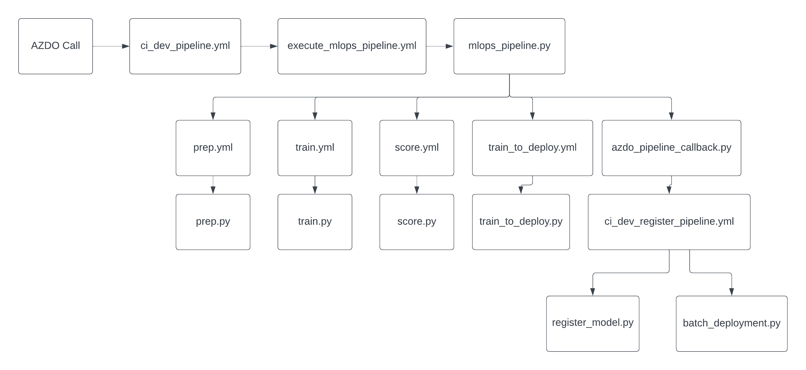
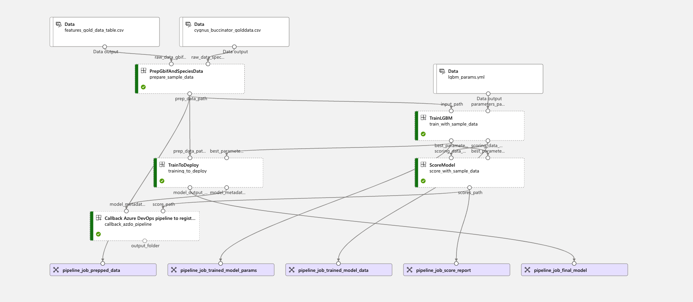
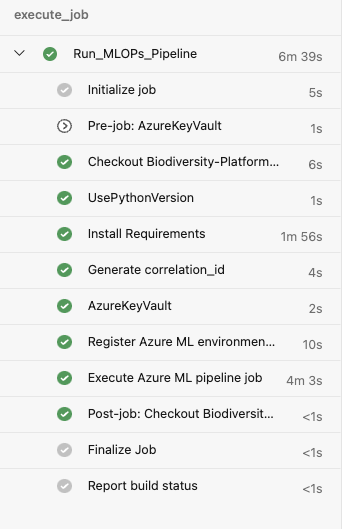

# MLOps - Train Models Pipeline

[[_TOC_]]

This document explains all the stages in the MLOps pipeline, which are as follows:

- Data Preparation
- Training
- Scoring
- Training for Deployment
- Callback Pipeline

## Machine Learning Lifecycle



## Code Structure

```tree
|
|-- .pipelines
|   |-- mlops
|       |-- templates
|           |-- execute_mlops_pipeline.yml
|       |-- ci_dev_pipeline.yml
|       |-- ci_rel_pipeline.yml
|-- mlops
|   |-- biodiversity
|       |-- src
|           |-- mlops_pipeline.py
|           |-- batch_deployment.py
|           |-- register_model.py
|           |-- azdo_callback_pipeline.py
|       |-- config
|           |-- lgbm_params.yml
|           |-- candidate_species.csv
|-- products
|       |-- biodiversity
|           |-- src
|               |-- mlops
|                   |-- prep_src
|                       |-- prep.py
|                   |-- train_src
|                       |-- train.py
|                   |-- score_src
|                       |-- score.py
|                   |-- train_to_deploy_src
|                       |-- train_to_deploy.py
|                   |-- prep.yml
|                   |-- train.yml
|                   |-- score.yml
|                   |-- train_to_deploy.yml
|               |-- models
|                   |-- lgbm.py
|                   |-- parameters.py
|
|       |-- common
|           |-- src
|               |-- utils
|                   |-- data_utils.py
|                   |-- read_utils.py
|                   |-- write_utils.py
|
```

All the code above is tested, exception being the `.yml` files and the files in the `mlops/biodiversity` folder.

## Execution

The configuration for this pipeline can be found in `.pipelines/mlops/ci_dev_pipeline.yml` (for the development environment) and `.pipelines/mlops/ci_rel_pipeline.yml` (for the release environment). In Azure DevOps, the pipeline is called `[MLOps] Train Models`. The code in this configuration file then calls `.pipelines/mlops/templates/execute_mlops_pipeline.yml` from  where the `mlops_pipeline.py` code is called.

### MLOps Flow



## Sample Pipeline Execution in AzureML



## mlops_pipeline.py

This python file handles the creation of the pipeline components and the execution of the pipeline. It parses the arguments received from the `.yml` file and passes them to the `main` function, which then calls the `mlops_pipeline` function. As you can see the variables passed to the main function are all attributes of the `args` object, which is used for the parsing. All of the files in this project have a very similar structure in this regard.

However, for the files in the `products/biodiversity/src/mlops` we are not passing `sys.argv[1:]` to the `main` function but the parameters explicitly. This is because when performing unit tests the `main` function would appear as being called with no arguments, so the test would automatically fail.

In the `mlops_pipeline` function the path to the inputs files is specified and the actual pipeline is created in the `mlops_species` function. The file structure is hardcoded in the `mlops_pipeline.py` file.

```python
# azureml:<site-name>-training-features:@latest
raw_data_gbif_asset = f"{site_name}-training-features"
raw_data_gbif_version = next(
    i.latest_version for i in client.data.list() if i.name == raw_data_gbif_asset
)
raw_data_gbif_path = f"azureml:{raw_data_gbif_asset}:{raw_data_gbif_version}"

species_file_name = lower_replace(species_name, "-", "_") + "_golddata.csv"

# azureml:<site-name>-training-species:@latest
raw_data_species_asset = f"{site_name}-training-species"
raw_data_species_version = next(
    i.latest_version for i in client.data.list() if i.name == raw_data_species_asset
)
raw_data_species_path = f"azureml:{raw_data_species_asset}:{raw_data_species_version}"
```

The data is stored as [Data Assets](https://learn.microsoft.com/en-us/azure/data-catalog/data-catalog-how-to-manage), which support versioning. These **Data Assets** can be accessed in AzureML by clicking on the **Data** tab in the **Assets** section. An example of how these assets look like is displayed below:


Additionally, the paths to the config files which call all the `.py` files is provided in the load components step.

They are loaded as [components](https://learn.microsoft.com/en-us/azure/machine-learning/concept-component) (a self-contained piece of code that does one step in a machine learning pipeline) and then provided as parameters in the `mlops_species` function.

```python
prepare_data = load_component(source=parent_dir + "/prep.yml")
train_model = load_component(source=parent_dir + "/train.yml")
score_data = load_component(source=parent_dir + "/score.yml")
train_to_deploy = load_component(source=parent_dir + "/train_to_deploy.yml")
```

The `mlops_species` function, which is defined within `mlops_pipeline`, is the one that creates the pipeline, which is indicated by the `@pipeline` decorator. Several arguments are passed in order to identify the pipeline. Additionally, in the `mlops_pipeline` function a callback pipeline is created only if the `wait_for_completion` argument is set to False.

Otherwise this pipeline will not be called and the pipeline that would be created in AZDO would wait for the completion of the run in AzureML. Notabene, AZDO has a default timeout of 1 hour. The code that implements the waiting functionality starts at line 256.

Within this file the **callback pipeline** is defined as well, but this is further detailed in the section dedicated to that pipeline.

One of the last steps taken in this function is instantiating the pipeline with the desired parameters, which is done in line 217. The call to the pipeline is made using the input variables that are strings as inputs, and the inputs that are folders or files are passed as `Inputs`, which is an `azure.ai.ml` object. The pipeline is actually called in line 243, with the command `client.jobs.create_or_update`.

### Components

In the `mlops_species` function the components of the pipeline are created:

- `prepare_sample_data`
  - called by the `prep.yml` config file
  - uses inputs provided by the user
  - implements the code from `prep.py`
  - outputs:
    - `prep_data_path` - output files stored in a temporary Azure Blob storage that contains the preprocessed data in `.csv` format split into 2 files: features and targets
- `train_with_sample_data`
  - called by the `train.yml` config file
  - uses inputs from the user as well as from the previous component, `prepare_sample_data.outputs.prep_data_path`. In order to use the output of one component as input to another there is no need to specify a path, as that is automatically taken care of by AzureML, which takes the outputs of the previous components from temporary storage
  - additional input from `mlops/biodiversity/config/lgbm_params.yml`, which contains an initial guess of the best parameters for the Light Gradient Boosted Tree and the list of parameters to tune
  - implements the code from `train.py`
  - outputs:
    - `best_parameters_path` - output folder stored in Azure Blob storage which contains the best parameters obtained after running hyperoptimization stored in `.json` format
    - `scoring_data_path` - output folder stored in Azure Blob storage which contains the features and targets datasets split in training and test sets
- `score_with_sample_data`
  - called by the `score.yml` config file
  - uses both outputs of the `train_with_sample_data` component
  - implements code from `score.py`
  - outputs:
    - `scores_path` - output folder stored in Azure Blob storage which contains the classification report, confusion matrix and the metrics stored in `.json` format
- `training_to_deploy`
  - called by the `train_to_deploy.yml` config file
  - uses `prepare_sample_data.outputs.prep_data_path` and `train_with_sample_data.outputs.best_parameters_path`
  - implements code from `train_to_deploy.py`
  - outputs:
    - `model_output` - output folder stored in Azure Blob storage which contains the model saved in MLFlow format
    - `model_metadata` - output file stored in Azure Blob storage which contains the `runid` and `runuri` values
- `callback_pipeline`
  - called only if the `wait_for_completion` variable is set to False
  - does not have a dedicated `.yml` file
  - inputs: `training_to_deploy.outputs.model_metadata` and `score_with_sample_data.outputs.scores_path`
  - implements the code from `azdo_pipeline_callback.py`, no configuration file for this one
  - outputs:
    - None

The pipeline has several return values that can be further used. In our MLOps pipelines however we do not use any of them.

All the components of the pipeline are using a common `correlation_id`, which is used to track the different stages in AppInsights through the AzureLogger.

## Stages

A high level overview of the functionality of the different stages of the pipeline is provided below.

### Data Preparation

In this stage [GBIF](https://planetarycomputer.microsoft.com/dataset/gbif) and species specific data is read. This data comes from **Azure Blob storage**.

In this stage basic data processing is applied: column and null value dropping, converting ids to integers. The datasets are inner joined on the `gbifid` column and the target value is binarized by converting ABSENT and PRESENT to 0 and 1 respectively. This stage returns the features and targets as separate dataframes.

### Training

In this stage the data from the preparation stage is split into training and test sets, using the `split_train_test` function form the `data_utils` folder. This function supports a validation set as well, but this is not being used here.
A set of parameters to tune is then read and used in the hyperoptimization algorithm of choice. The `model_objective` is then configured, where the targets and features are defined, the number of folds is set for the k-fold cross-validation, as well as the verbose.

The model trained is a Light Gradient Boosted Tree, using the [LightGBM library](https://lightgbm.readthedocs.io/en/v3.3.2/). For the hyperoptimization process the [`tpe` (Tree of Parzen Estimators)](https://proceedings.neurips.cc/paper/2011/file/86e8f7ab32cfd12577bc2619bc635690-Paper.pdf) algorithm is used, which is implemented in the [hyperopt library](http://hyperopt.github.io/hyperopt/#hyperopt-distributed-asynchronous-hyper-parameter-optimization).
All the functions that are used to run the hyperoptimization process can be found in the `/products/biodiversity/src/models/parameters.py` and the `/products/biodiversity/src/models/lgbm.py` files.
After the hyperoptimization process is complete the parameters that rendered the best results are stored in `best_parameters.yml` and the hyperoptimization trials are logged using MLFlow. These results can be observed in the Metrics tab in AzureML for the training step.
Other outputs of the network are the training and test datasets, that are split into features and targets.

### Scoring

In the scoring stage a model is generated using the set of best parameters and then trained using the training data (features and targets). The model is then used to predict the values for the test dataset and compare them to the actual values of the targets.
The evaluation is done using the `evaluate` function, which generates the Receiver Operator Curve - Area Under the Curve metric and accuracy, as well as the precision, recall, F1-score and the support for the ABSENT and PRESENT class, the weighted and macro averages for the 2 classes.

These metrics are logged using MLFlow and can be found in the Metrics tab of the AzureML job. The `evaluate` function also generates the confusion matrix. The `write_results` function is then called, which writes the classification report to `metrics.json` and saves the confusion matrix and the classification report as images, more specifically, heatmaps.

### Train to Deploy

In this stage the model is trained on the full dataset created by the preparation stage. The model is instantiated using the best parameters obtained from the hyperoptimization process. Once the model is trained it is saved using MLFlow. The name used for the model is **lgbm_gbif_model**, which will then be used to retrieve the model in the scoring stage of the batch deployment.
When saving with MLFlow a folder is generated that contains multiple artifacts:

- `conda.yml` - specifies the environment necessary to load the model
- `MLmodel` - model in MLFlow format
- `model.pkl` - model in pickle format, does not need to be read exclusively by MLFlow
- `python-env.yml` - list of dependencies for python
- `requirements.txt` - contains the packages required for the model

Metadata that contains the `runuri` and the `runid` is saved and written to Azure Blob Storage.

### Callback Pipeline

This stage triggers the callback pipeline which registers the model and creates endpoints and batch deployments. This topic is further explained in the document dedicated to the callback pipeline.

- [MLOps - Callback Stage (Register Models)](./mlops-callback-pipeline.md)

### Configuration Files

#### ci_dev_pipeline.yml and ci_rel_pipeline.yml

These pipelines call several `.yml` templates that make sure the execution of the MLOps pipeline goes smoothly.

 The pipeline executes multiple jobs:

- `UsePythonVersion` and `Install Requirements`- installs the requirements for the job
- `AzureKeyVault` - accesses the secrets in the key vault, which contains information such as the pipeline personal access token - the variables used in this stage are taken from `MLOps-CORE-VG`
- `Generate correlation_id` - generates and passes down the `correlation_id` such that all processes can be tracked in AppInsights
- `Register Azure ML environment (conda)` - executes the commands in `.pipelines/mlops/templates/create_environment.yml`, sets parameters for the execution such as the conda environment, the environment image, version and name
- `Execute Azure ML pipeline job` - executes the commands in `.pipelines/mlops/templates/execute_mlops_pipeline.yml`; `pipeline_pat`, `exec_environment`, `number_of_folds` and `maximum_evaluations` are passed as parameters to `mlops_pipeline.py`



#### execute_mlops_pipeline.yml

The `execute_mlops_pipeline.yml` calls `mlops_pipeline.py` which implements the loop that trains, registers and deploys multiple models for multiple species and sites. The loop is called in BASH:

```console
species=($(tail -n +2 $(Build.SourcesDirectory)/mlops/biodiversity/config/candidate_species.csv | tr " " "-" | awk -F " ", '{print $1}'))
i=0
while [ $i -lt ${#species[@]} ]
do
 python ...
done
```

At the moment this iterates only over the species which are stored in `mlops/biodiversity/config/candidate_species.csv`, which are passed as a parameter to the python command as `${species[$i]}`. For an implementation of multiple `sites` it would suffice
to run a similar loop over a file that contains the name of the sites for which you want to train the models.

#### prep.yml, train.yml, score.yml, train_to_deploy.yml

All these configuration files are called within the `mlops_pipeline.py` file.

These `.yml` files contain all the inputs that the python file with the same name expects to receive from `mlops_pipeline.py`, as well as outputs that will then be used by other stages of the pipeline. It is very important to specify the outputs as these will be written automatically to AzureML temporary storage and are the ones that can be used by other components. Outputs have to also be provided as parameters to the BASH command that calls the python file.

## Testing

All the files that implement unit and integration tests for these files can be found in `products/biodiversity/tests`.
