# Observability

[[_TOC_]]

## Azure Logger

Logs and metrics must be sent from the application to App Insights. In order to do this, the code must be instrumented. To instrument our python code we are using the OpenCensus Python SDK according to the official App Insights documentation
([click here to view documentation](https://learn.microsoft.com/en-us/azure/azure-monitor/app/opencensus-python)). The instrumentation is wrapped in a class called `AzureLogger`, which is located here:

```tree
|
|-- products
|       |-- common
|           |-- src
|               |-- azure_logger.py
```

All python scripts in the application use an instance of AzureLogger to log events and debug information. This way, all of the logs are automatically sent to App Insights and the individual scripts don't need to be concerned with instrumentation.

To connect to AppInsights, the AzureLogger requires a connection string. This is taken from an environment variable `APPLICATIONINSIGHTS_CONNECTION_STRING` which is populated through access to the azure key vault (see section below). Optionally, a correlation id can be configured to trace calls across multiple parts of the application and make it easier to search for related log statements in App Insights. The term correlation id is used by OpenCensus, it is also known as operation id in App Insights.

To configure the correlation id, it must be passed to AzureLogger upon creation. Typically it is given as an argument when executing a script. During a pipeline run it can be created randomly during a pipeline step (for an example, see .pipelines/ci_dev_register_pipeline.yml) and then passed as a parameter.

```python
azure_logger = AzureLogger(correlation_id=args.correlation_id, level=logging.DEBUG)
```

Three different types of data are collected and sent to App Insights by the Azure Logger.

1. Logs are any kind of log statements made with an instance of AzureLogger. Log statements can be exceptions, events or traces.
2. Metrics, some standard metrics are automatically collected and sent to AppInsights, additional custom metrics must be configured manually. Currently, the application does not configure any custom metrics, but the exporters are available so the basis to add them is already there.
3. Tracing information (not to be confused with traces), tracing tracks calls through different parts of the application using the correlation id. In App Insights this is also known as dependencies.

The three most commonly used methods of the AzureLogger are:

1. log: sends a simple log statement which will show up in the table `traces` in App Insights. This method is used for debug level statements.
2. event: sends an event which will show up in the table `customEvents` in App Insights. This method is used for info level statements.
3. exception: sends an exception which will show up in the table `exceptions` in App Insights. This method is used for error level statements.

## App Insights connection string

To connect to App Insights, the AzureLogger requires a connection string. This is taken from an environment variable `APPLICATIONINSIGHTS_CONNECTION_STRING`.

To populate this environment variable every python script accesses a given Azure key vault, typically at the beginning of the main method, and retrieves the connection string from the key vault. Here's an example from the script perform_inference.py:

```python
if args.key_vault_name is not None:
        key_vault_utils.get_environment_from_kv(args.key_vault_name)
```

The key vault must contain a secret called `APPLICATIONINSIGHTS-CONNECTION-STRING`, which will be retrieved and saved in the environment variable `APPLICATIONINSIGHTS_CONNECTION_STRING` (note the change from dashes to underscores). The AzureLogger reads from this environment variable when it is instantiated and uses it to connect to App Insights.

If the environment variable is not set when AzureLogger is instantiated, a warning message will be logged to the console (see azure_logger.py):

```python
self.__trace_logger.warning(
    "Environment variable APPLICATIONINSIGHTS_CONNECTION_STRING not set "
    "or is invalid, local logging only."
)
```

This message usually shows up in the logs of any pipeline run, even if the App Insights connection is actually working. This happens when an AzureLogger is instantiated before the secret was read from the key vault. However if you see a second message confirming the succesful connection to App Insights, this warning is not cause for concern.

```python
self.__trace_logger.info(
    "App Insights logging configured successfully. "
    "Logs will be exported to App Insights."
)
```

## Custom dimensions

Any log statements (traces, events, exceptions) can be enriched with custom dimensions. These are added as a dictonary, their names and values are entirely custom, you can choose anything you like. Here's an example from the script perform_inference:

```python
azure_logger.event(
    "completed perform_inference",
    **{"duration (s)": str((end_time - start_time))},
)
```

In this case, the custom dimension "duration (s)" can be used in App Insights for log queries, for example to calculate the average duration of the script running. It is much easier to query, display or use these values if they are given as custom dimensions instead of only putting them in the log message via formatted strings. Here's another example from the script perform_inference:

```python
azure_logger.log(
    f"Invoking batch endpoint {endpoint_name} with input {batch_input_path}",
    **{
        "endpoint_name": endpoint_name,
        "species_name": species_name,
        "input": batch_input_path,
    },
)

[...]

azure_logger.event(
    "Batch endpoint invoked",
    **{"endpoint_name": endpoint_name, "species_name": species_name},
)
```

It makes sense to be consistent when naming custom dimensions (in this example `endpoint_name` and `species_name` are reused), so that later you can easily query all log statements related to a certain endpoint or certain species. This consistency is however the responsibility of the developer and is not enforced by OpenCensus, since custom dimensions are - as the name says - entirely custom.

## See Observability Data in Azure Portal

All of the data that is sent by the AzureLogger to App Insights can be viewed in the Azure Portal in the App Insights resource. Some useful views are:

- Transaction Search: Overview of all data that has been sent to App Insights (traces, events, dependencies, exceptions, etc.) in order. Can be searched by correlation id.

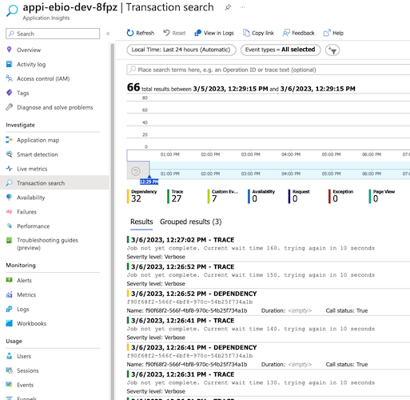

- Failures: In the exception tab you can see an overview of recent exceptions.

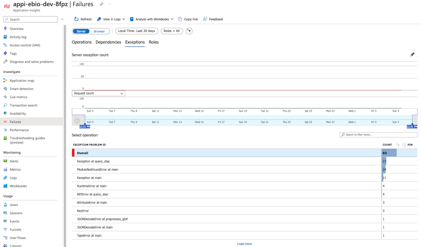

- Metrics: Overview of any metric over time. The application doesn't collect custom metrics at the moment, but this view is still useful for default metrics, such as number of emitted log events over time, exceptions over time, etc.

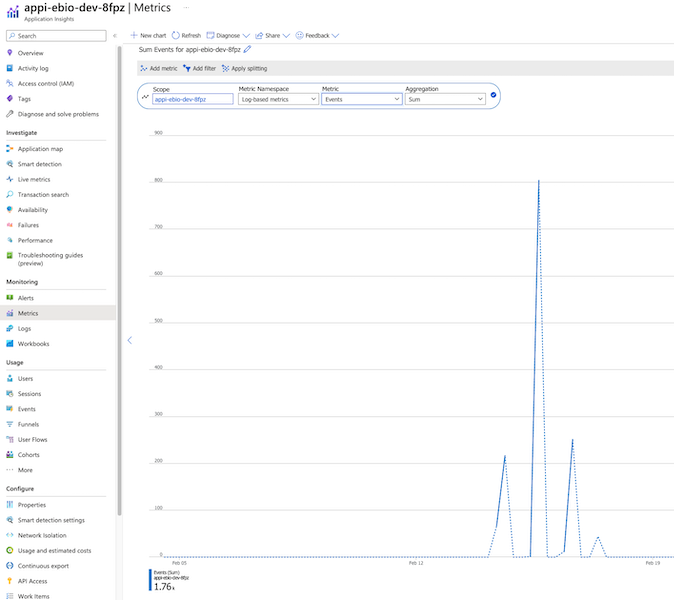

- Events: Overview of recent events, see number of events received over time and details about the events.

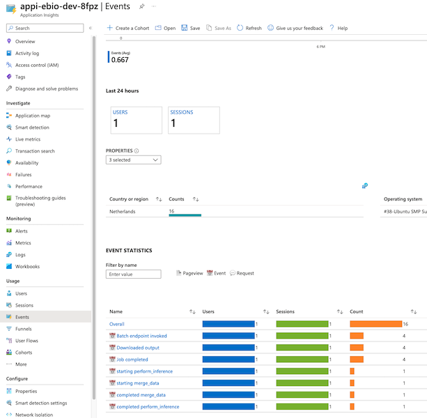

- Logs: In this view you can write Kusto queries to see any logs you are interested in. Relevant tables are traces, customEvents and exceptions. If the application had defined any custom metrics they would be found under customMetrics. Kusto queries are a powerful tool to gain insights from logs, especially if combined with custom dimensions. Click [here](https://learn.microsoft.com/en-us/azure/data-explorer/kusto/query/tutorial?pivots=azuredataexplorer) to see the tutorial on Kusto queries.

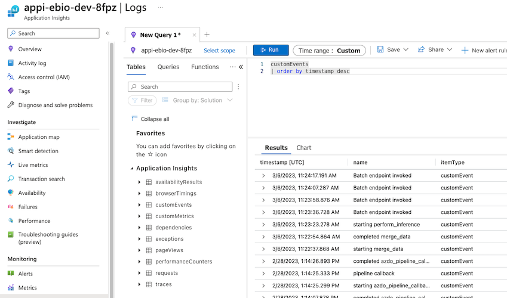

## Create App Insights dashboard

When looking at App Insights in the Azure Portal, there's a button at the top labeled "Application Dashboard".

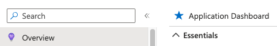

This brings you to the default dashboard, containing an overview of a few default metrics. However, this default dashboard is designed for applications with a frontend, so a lot of metrics displayed in the default dashboard are not relevant for our application, for example page load time.

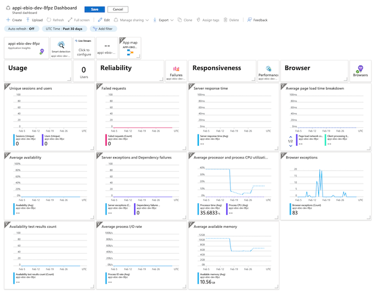

Instead, we can create our own dashboard. To add interesting views to the dashboard you can navigate to them in Azure Portal and there's usually a button saying "Pin to dashboard" or "Save to dashboard".

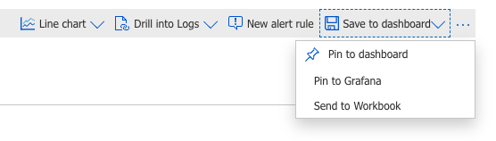

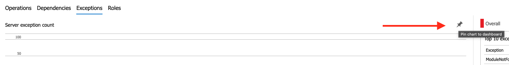

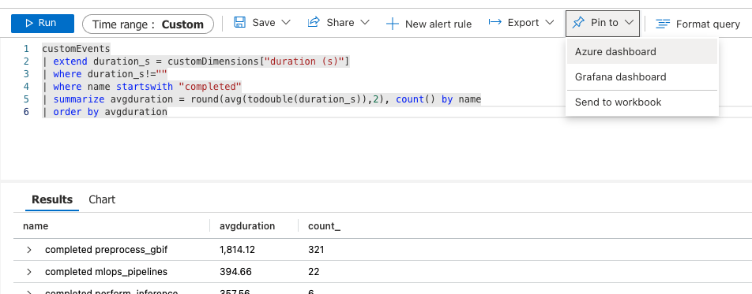

It's especially useful to save complex Kusto queries to the dashboard or even render them as a graph. Any of the logs, events, custom dimensions, etc. that have been sent to App Insights can be used to create interesting tiles on a dashboard. Here are some ideas:

- Average duration of script runs
- Number of exceptions over time
- Error rate for each script
- Complexity measured by the number of dependencies per correlation id

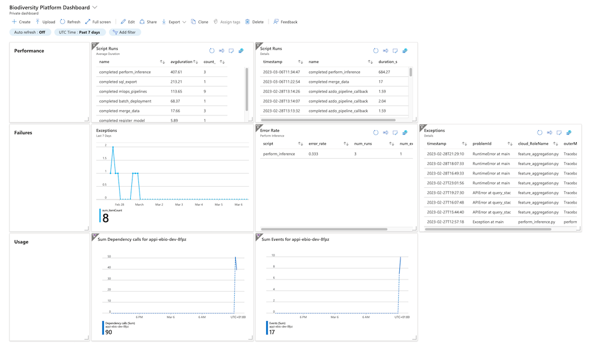

## Alerting

You can create an alert on any metric or custom log search available in App Insights. To do so, go to the Alerts view and click "Create" to create a new alert rule.

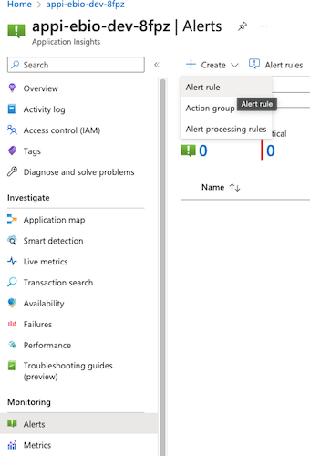

Pick any metric or log search that you want to use as a signal for the alert.

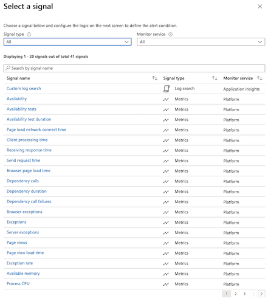

Then, specify the condition on this signal under which the alert is triggered. For example, if there are more than 5 exceptions in the past 6 hours.

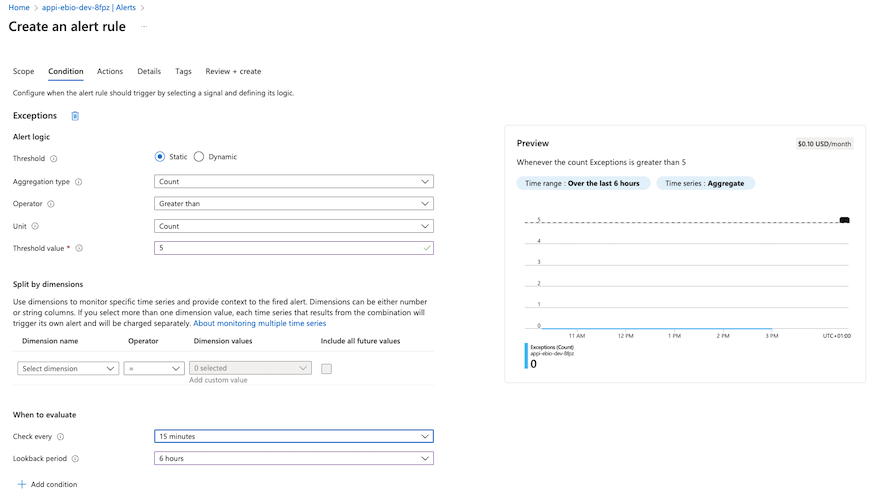

Note that creating an alert incurs some monthly cost on Azure, depending on the exact nature of your condition. You can see the estimated cost on the top right. You can define actions to be executed when the alert is triggered as well, under the "Actions" tab.

## Current limitations

Currently, the application does not configure any custom metrics. However, the AzureLogger class already has an exporter for metrics so it would not be difficult to add this when following the documentation.

The correlation id has to be passed as a parameter to the script when run inside a pipeline. Currently, not all pipelines do this, so not all logs are correlated.

## Supporting Documentation

- [Application Insights for AML Pipelines](https://learn.microsoft.com/en-us/azure/machine-learning/v1/how-to-log-pipelines-application-insights)
- [Instrumenting Python Applications with OpenCensus](https://learn.microsoft.com/en-us/azure/azure-monitor/app/opencensus-python)
- [Kusto Queries Tutorial](https://learn.microsoft.com/en-us/azure/data-explorer/kusto/query/tutorial?pivots=azuredataexplorer)
